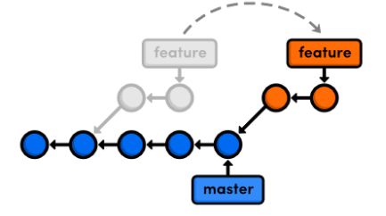
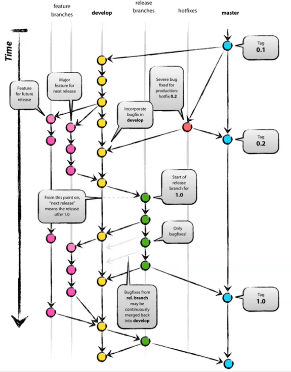
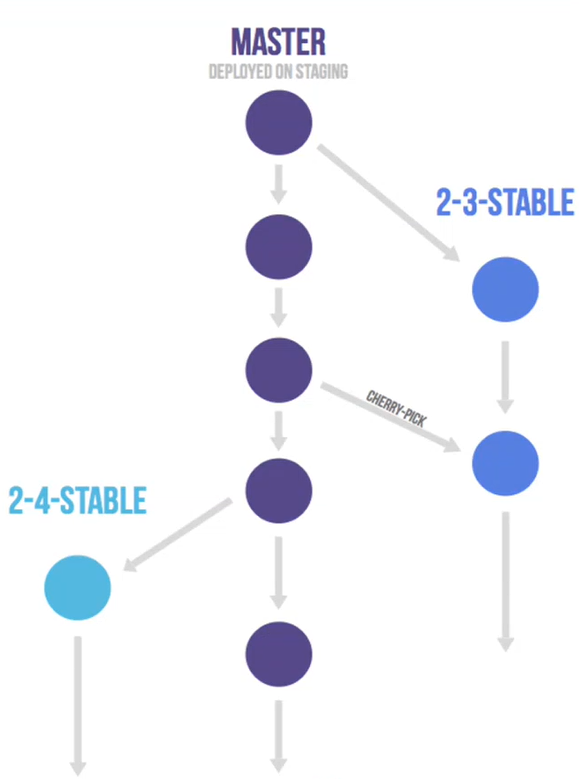
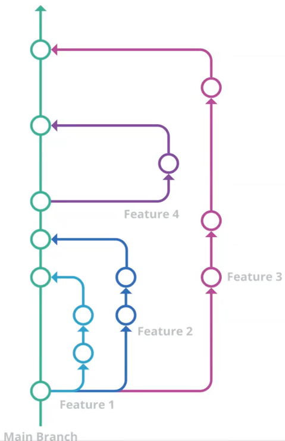
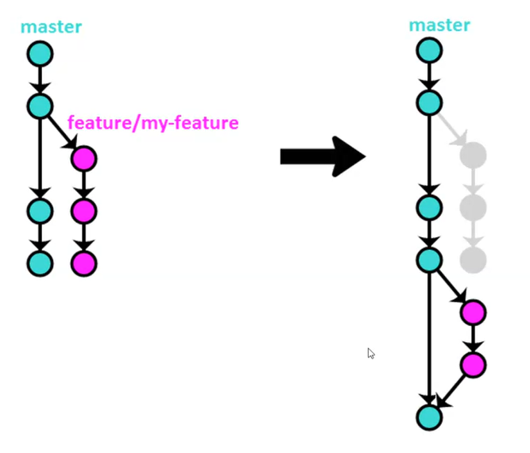
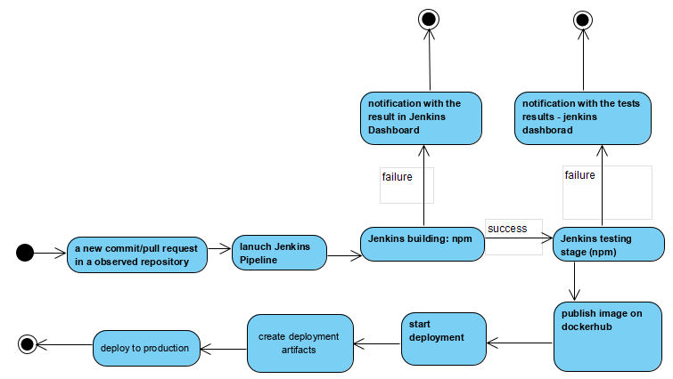
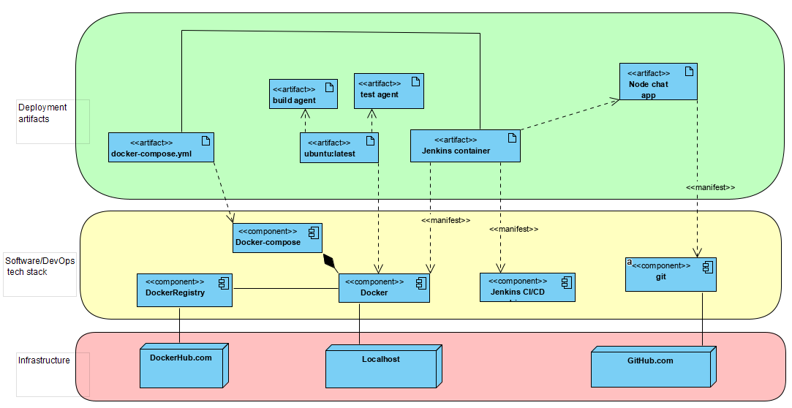
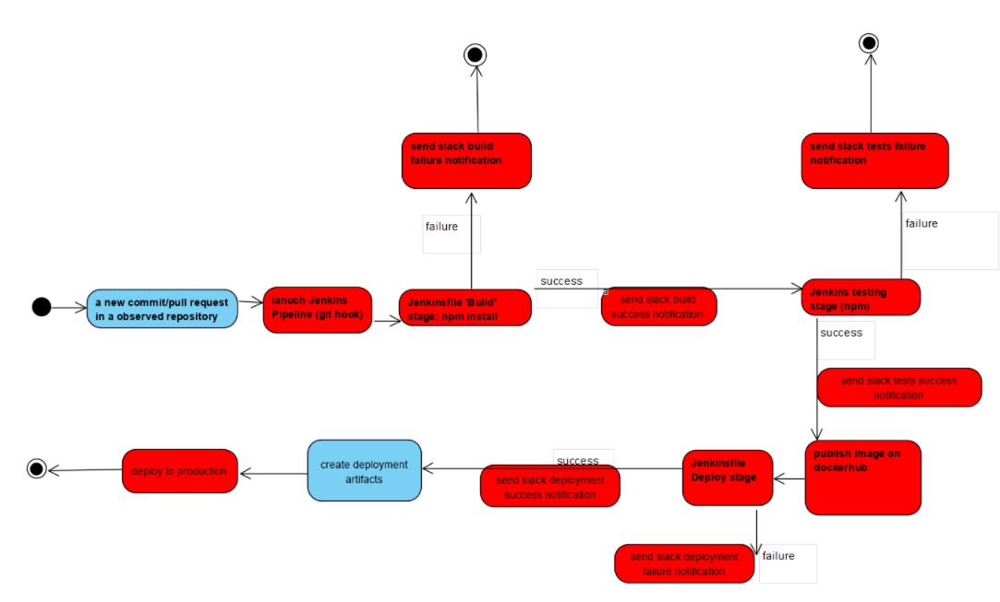
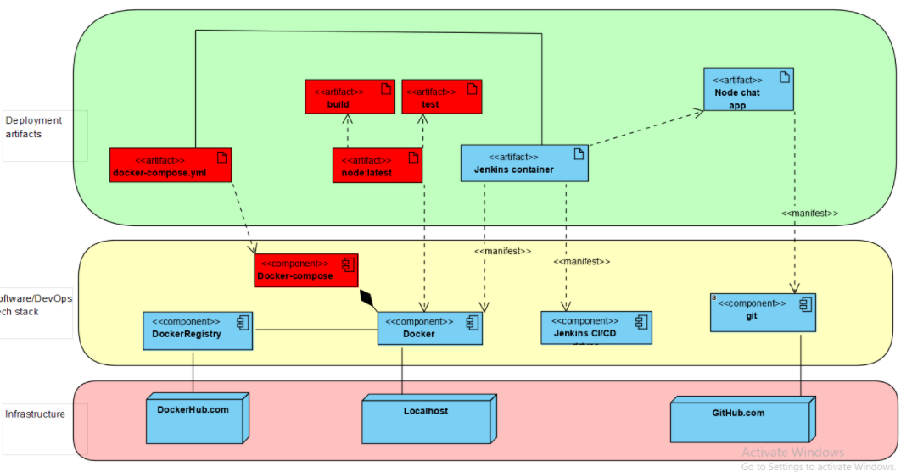

# DevOps

Diagram : [link](https://raw.githubusercontent.com/gregwell/university-notes/main/english/devops/images/diagram.png)

# Git

## 1. Git operations

**git squash** - to "squash" in Git means to combine multiple commits into one. You can do this at any point in time, though it is most often done when merging branches.

**git rebase** - :



## 2. Git flows

- Git flow



- Gitlab flow



- Github flow



- One flow



## Git hooks

- created git hook *commit-msg* which does not allow a commit message that does not contain a keyword at the beginning

```bash
word="GS306504"
isPresent=$(grep ^"$word" $1)

if [[ -z $isPresent ]]
  then echo "Commit message WRONG, $word should be at the beginning"; exit 1;
  else echo "Commit message OK"; exit 0;
fi
```

# Docker

## Lab 3. Simple Dockerfile

**Task:** 

1. *create a Dockerfile that is based on the latest ubuntu (ubuntu:latest).*
2. *add it to your branch.*
3. *make sure it has git installed if it doesn't already have it (in the Dockerfile).*
4. *run the container, download our repository to it. Make sure your branch is there.*

**Files:**

Dockerfile:

```docker
FROM ubuntu:latest
RUN apt-get update && \
    apt-get upgrade -y && \
    apt-get install -y git
```

In terminal:

```bash
docker build -t first-docker .
docker run -it first-docker
git clone https://github.com/InzynieriaOprogramowaniaAGH/MIFT2021.git
```

## Lab 4. Running node-chat-app in a container

**Task:**

1. *create a personal branch for this class according to the scheme from the previous week (e.g.: Group01-KM123456_Lab03). Remember to create it from your group branch!
1.1 Publish an image from the previous class in the Docker HUB ([https://hub.docker.com/](https://hub.docker.com/))*
2. *Write yourself or find any messeging app (opensource messeging app) on the internet.*
3. *Build agent: Create a new Docker container image (new Dockerfile) and configure it to be able to perform the operation of building a "messenger" from source (compilation, linking, dependencies, etc.)*
4. *test agent: Create a new docker container image (new Dokerfile) and configure it to be able to perform the operation of testing the "communicator" using the previously built program in point 3.*
5. *create docker-compose.yml file ([https://docs.docker.com/compose/](https://docs.docker.com/compose/)). Add it to your branch. Using images 3) and 4) create an environment that:*
- *clones the latest version of "messenger" from the repo*
- *builds it*
- *test if it works (you can use more than 1 instance of image 4) if necessary.*

**Ex. 1**

`git checkout -b Grupa05-GS306504_Lab04` - created a new branch 

`docker login -u gregwell` - signed in to *dockerhub.com*

`docker build -t gregwell/grupa05gs306504lab03:latest .` - built a docker image

`docker push gregwell/grupa05gs306504lab03` -pushed the image to a registry

**Ex. 2-5**

**Dockerfile-build**

```docker
FROM node:latest
WORKDIR /data
RUN git clone [https://github.com/binhxn/node-chat-app.git](https://github.com/binhxn/node-chat-app.git) /data/app
WORKDIR /data/app
RUN npm install
EXPOSE 3000
```

**Dockerfile-test**

```docker
FROM nodechat-build:latest
WORKDIR .
CMD [ "npm", "test" ]
```

**docker-compose.yml**

```docker
version: '3.3'
services: 
    build:
        container_name: nodechat-build
        image: nodechat-build:latest
        ports:
            - "3000:3000"
        build: 
            context: .
            dockerfile: Dockerfile-build
    test: 
        container_name: nodechat-test
        image: nodechat-test:latest
        build: 
            context: .
            dockerfile: Dockerfile-test
        depends_on:
        - build
```

**Notes:**

- `git clone` command is usually run outside of the Docker. There are a couple of reasons for this: ([stackoverflow answer](https://stackoverflow.com/questions/63783323/getting-copy-failed-stat-when-trying-to-copy-package-json-file-in-docker-on-dig))
    - it lets you check the Dockerfile into the repository
    - it lets you build an image out of something you haven't committed yet
    - Docker layer caching doesn't prevent you from seeing changes in the source repository
    - you don't want your GitHub credentials from being visible in plain text in docker history.
- Exposing vs publishing ports:
    - `EXPOSE` only opens the port in the container, making it accessible by other containers.
        - The EXPOSE instruction does not actually publish the port. It functions as a type of documentation between the person who builds the image and the person who runs the container, about which ports are intended to be published. To actually publish the port when running the container, use the -p flag on docker run.. Like VonC mentioned, the run -p part can be done with docker-compose.yml (the ports field). [from [docker documentation](https://docs.docker.com/engine/reference/builder/#expose)]
    - `"3306:3306"` will publish the port on the host, making the same port accessible from the host. It maps container port to the host.

    ```
    ports:
     - "3306:3306"
    ```

## Lab 5: Jenkins as CI/CD driver

### **Task:**

1. *familiarize yourself with the diagram discussed in class.*
2. *familiarize yourself with the Jenkins software: [https://www.jenkins.io/](https://www.jenkins.io/).*
3. *create a Jenkins Docker container using the instructions [https://www.jenkins.io/doc/book/installing/docker/](https://www.jenkins.io/doc/book/installing/docker/)*
4. *Upload your Jenkins image to DockerHub just like the previous images.*
5. *from within Jenkins running in a container (point 2) run docker-compose created within Lab04.*
- *we assume Jenkins is running in a container*
- *we assume that after Lab04 docker-compose.yaml file is in our repository*
- *we assume that from Jenkins we download the repo where our docker-compose.yaml file is*
- *assume Jenkins runs the docker-compose.yaml file and creates the environment with Lab04*
- *note that running docker-compose requires.yaml of the Docker software*

### **Notes:**

- Created a bridge network in Docker using the following docker network create command

    `docker network create jenkins`

- In order to execute Docker commands inside Jenkins nodes, downloaded and run the *docker:dind* Docker image

```docker
docker run --name jenkins-docker --rm --detach \
  --privileged --network jenkins --network-alias docker \
  --env DOCKER_TLS_CERTDIR=/certs \
  --volume jenkins-docker-certs:/certs/client \
  --volume jenkins-data:/var/jenkins_home \
  --publish 2376:2376 docker:dind --storage-driver overlay2
```

- To customise official Jenkins Docker image created a Dockerfile:

```docker
FROM jenkins/jenkins:2.277.2-lts-jdk11
USER root
RUN apt-get update && apt-get install -y apt-transport-https \
       ca-certificates curl gnupg2 \
       software-properties-common
RUN curl -fsSL https://download.docker.com/linux/debian/gpg | apt-key add -
RUN apt-key fingerprint 0EBFCD88
RUN add-apt-repository \
       "deb [arch=amd64] https://download.docker.com/linux/debian \
       $(lsb_release -cs) stable"
RUN apt-get update && apt-get install -y docker-ce-cli
USER jenkins
RUN jenkins-plugin-cli --plugins "blueocean:1.24.6 docker-workflow:1.26"
```

- Built a new docker image from this Dockerfile

```docker
docker build -t myjenkins-blueocean:1.1 .
```

- Run new docker image as docker container

```docker
docker run --name jenkins-blueocean --rm --detach `
  --network jenkins --env DOCKER_HOST=tcp://docker:2376 `
  --env DOCKER_CERT_PATH=/certs/client --env DOCKER_TLS_VERIFY=1 `
  --publish 8080:8080 --publish 50000:50000 `
  --volume jenkins-data:/var/jenkins_home `
  --volume jenkins-docker-certs:/certs/client:ro `
  myjenkins-blueocean:1.1
```

- went to [localhost:8080](http://localhost:8080) to unlock jenkins
- created new jenkins job *freestyle* of type
- configured to execute the following shell scirpt as a build step:
```
cd Grupy/Grupa05/GS306504/Lab04
pwd
ls
docker --version
curl -L https://github.com/docker/compose/releases/download/1.1.0/docker-compose-`uname -s`-`uname -m` > /usr/local/bin/docker-compose
chmod +x /usr/local/bin/docker-compose
docker-compose --version
docker-compose up
```

### **Issues:**

1. **Permissions denied when downloading docker-compose from the url with curl command**

**Cause**:

- the user that is executing the script in jenkins is 'jenkins', such operations(saving to system folders) can be done only by root

**Solution**:

- addded 'jenkins ALL=(ALL) NOPASSWD: ALL' to /etc/sudoers file
- *(temporary solution! need to be solved permamently in the future)**

**2. Never-ending loading after running docker-compose in jenkins.**

**Cause**:

- Dockerfile-build do not finish its work
- Problem with understanding how docker works.
- If I start an application via 'npm start' and don't terminate it then jenkins will wait until it terminates. In this case, forever.
- Dockerfile-build should just clone the repo, install dependencies with 'npm install'.
- The Dockerfile-test file tests if the program works correctly, no need to do it in Dockerfile-build.

**Solution**:

- Delete 'npm start' from Dockerfile-build

## Lab 6: Release pipeline

### **Task:**

*In today's class you will play the role of a DevOps developer whose task is to prepare a release pipeline plan (sequence of implementation steps) and to prepare a document (in pdf format) presenting the planned process. You do not have to implement the process at this point! Before you start implementing them, read the Jenkinsfile concept very carefully ([https://www.jenkins.io/doc/book/pipeline/](https://www.jenkins.io/doc/book/pipeline/) with subsections as needed). Eventually in the future a large part (or even the whole) of the plan you create will have to be included in a Jenkinsfile.*

*The program that is the subject of the pipeline is the one you chose in Lab 4. Remember that in order to have your own copy of the open source program repository (e.g. to modify it, place additional files, git hooks, etc.) you can use the "fork" option, as described here: [https://guides.github.com/activities/forking/](https://guides.github.com/activities/forking/).*

1. *the plan file is to contain or meet the following requirements:*
- *title page with information who, for what application, when, with planned use of what technologies prepared this plan*
- *activity diagram (UML Activity diagram) showing in a schematic way all activities and main decisions. You can (and even should) refer to the "CI/CD Pipeline" diagram discussed in the lecture, but each of the general steps should be 1) detailed - broken down into specific actions*
1. *indicate the specific technology planned to be used in a given step.*
- *an implementation diagram (UML Deployment Diagram) analogous to the one discussed in Lab 5. It should be adjusted to reality, missing elements should be added, those not present or not relevant should be removed.*
- *verbal discussion of all steps planned to be taken within the CI/CD Pipeline - concretely, not theoretically*
- *is to use the following technologies (maybe others)*
1. *git (including git hooks, GitHub)*
2. *docker (including docker compose)
(3) docker registry (including DockerHub)*
3. *Jenkins (including Jenkinsfile)*

### Release pipeline

**App**: Node chat app

**Date**: 16.05.2021

**Tech stack:** Github, Docker, Dockerhub, Jenkins

**What is what;**

- A **release** is a collection of artifacts in your DevOps CI/CD processes.
- An **artifact** is a deployable component of your application

**Activity diagram:**



**Deployment diagram:**



**Jenkins pipeline description:**

1. Detection of changes in repository - a new commit
2. Jenkins fetches data and starts deployment process based on Jenkinsfile.
3. Docker-compose.yml consists of two images
    - build: simply clones the repository and configures it, install dependencies etc.
    - test: runs tests
4. If build container fails to build itself the notification is sent to Jenkins Dashboard and the process stops.
5. If build container successfully builds itself, then the test container is to be run. If the tests fail the process stops and notification to Jenkins Dashboard is sent.
6. Then, a new image is published in dockerhub (new version) and the code is deployed to production.
<<<<<<< HEAD

## Lab 7: Pipeline CI/CD - basics & testing.

### Task

1. *your "source of truth" - place (copy) all source files (environment runtime scripts, Dockerfile, docker-compose.yaml, Jenkinsfile from these classes too etc.) in the repository InzynieriaOprogrammingAGH/MIFT2021.git.*

*Note: Maintain the following folder order:
<your folder>/<technology name>/<files> - e.g.: "KM123456/Docker/Dockerfile_rockechat_build"*

*Note: use meaningful declarative names, so that the file name itself indicates what it is for.*

*2 From your CI/CD pipeline plan created on Lab06, select the point(s) that are responsible for "Running fast and reliable testing."*

*2.1 Next, create a Jenkinsfile and place it in the messenger repo (this is not the same repo as for the scripts in point 1!).*

*2.2 (Optional) Note that you may want to do a "fork" on the original repo.*

*2.3 In the Jenkinsfile, create a new Jenkins pipeline (example here: [https://www.jenkins.io/doc/book/pipeline/jenkinsfile/](https://www.jenkins.io/doc/book/pipeline/jenkinsfile/)) , and in it, in the "stages" section, a new "stage('Test')".*

*2.4 Inside the Jenkinsfile in the "stage('Test')" section, script the test runs for the application from point 2.1. 2.1 - make sure that:*

- *the log with the effects of testing should go to the user ('notification of results')*
- *detect and handle the case when
-- tests succeed (100%)
-- tests fail (< 100%)*
1. *execute and demonstrate an example of executing these tests using Jenkinsfile.*
2. *upload Jenkinsfile to the repo from point 1.*

### What I have done:

- firstly forked the node-chat-app repository to clone it in my own IDE and add the Jenkinsfile (and check it into source control in my personal GitHub account)
- created a new Slack organization where the only person is me
- installed jenkins plugin: [Slack Notification](https://plugins.jenkins.io/slack/)
- configured the Jenkins integration with Slack in Slack settings (followed [this tutorial)](https://jenkinsplayground.slack.com/apps/new/A0F7VRFKN-jenkins-ci)
- created the following Jenkinsfile (followed the [Jenkins tutorial for builidng a Node.js/React app](https://www.jenkins.io/doc/tutorials/build-a-node-js-and-react-app-with-npm/))

```jsx
pipeline {

    agent {
        docker {
            image 'node:latest' 
            args '-p 3000:3000' 
        }
    }

	environment {
        CI = 'true' 
    }

  stages {
    stage('Build') {
      steps {
        sh "npm install"
      }
    }
    stage('Test') {
      steps {
        sh 'npm test'
      }
    }
  }
    post {
    
    	always {
    	    echo 'Finished!'
    	}
    	
    	success {
            slackSend (color: '#00FF00', message: "SUCCESSFUL: Job '${env.JOB_NAME} [${env.BUILD_NUMBER}]' (${env.BUILD_URL})")
            echo 'Success!'
    	}
    	
        failure {
            echo 'Failure!'
            slackSend (color: '#FF0000', message: "FAILED: Job '${env.JOB_NAME} [${env.BUILD_NUMBER}]' (${env.BUILD_URL})")
        }
    }
}
```

**Jenkinsfile notes:**

- in `agent` section's `docker` parameter:
    - the image section downloads the latest version of node image from dockerhub and runs this image as a separate container
        - it's downloaded only once, then Jenkins only need to run a new container from previously downloaded Node image.
    - in this scenario I have:
        - separate Jenkins and Node containers running locally in Docker.
        - **the Node container becomes the agent that Jenkins uses to run the Pipeline project.**
            - However, **this container is short-lived** - **its lifespan is only that of the duration of the Pipeline’s execution.**
    - `args` parameter makes the Node container (temporarily) accessible through port 3000.
- the *Build* stage ensures that there are downloaded all dependencies required to run the node chat application (and the tests)
- the *Test* simply run `npm test` to check if the app works correctly
- for the sake of testing, the notification is sent to slack channel when the build is successful and when it is not
- When the npm test command detects the environment variable CI with a value of true, then this command is run in "non-watch" (i.e. non-interactive) mode. In "watch" mode, npm test expects user input, which can pause running builds of CI/CD applications indefinitely. (TODO: Check if this is the case in my test script.)

**Comments:**

- when trying to make it work I installed the following plugins in Jenkins
    - NodeJS Plugin - *executes NodeJS script as a build step.*
    - Pipeline NPM Integration Plugin - *This plugin provides integration with Pipeline, configures npm environment to use within a pipeline job by calling sh npm or bat npm. The select npmrc will be configured and placed in the workspace prior to the build in order to take precedence over any user or global npmrc*
- finally I didn't made it work, so I decided to download new node image from dockerhub and run the app on this image-based container
- TODO: the above steps must be analysed - probably I will fully understand what is going on here when preparing next laboratory classes.

**Jenkins project**

- in Jenkins followed steps: New item → Pipeline → Pipeline script from SCM → pasted the link to forked node-chat-app github repo → Selected git → Saved

## Lab 8: Pipeline CI/CD - automatic build.

### Task

1. *extend Jenkinsfile from Lab07 with a new stage("Build") - documnetation with available commands is here: [https://www.jenkins.io/doc/book/pipeline/jenkinsfile/](https://www.jenkins.io/doc/book/pipeline/jenkinsfile/).*
2. *in stage("Build") make sure that:*
- *the latest source code version is downloaded from the repository*
- *the program is built*
- *the user is notified of both the success and failure of the build stage.*
1. *make sure that after a successful build the stage("Test") is run, but after a failed build this does not happen.*
2. *Write a git "post-commit" hook ([https://www.git-scm.com/docs/githooks#_post_commit](https://www.git-scm.com/docs/githooks#_post_commit)) for the messaged repository that displays the message "This is a commit hook that will someday run Pipeline after each new commit".*

### Notes

- changed a little bit the Jenkinsfile from the previous class
- in "Build" stage the program downloaded from the repository is built and all necessary dependencies are installed
- in this version of Jenkinsfile notifications to slack are send both when building and testing stage is executed
- when the Build stage is not successful the testing stage is not executed (screenshot attached)

```groovy
pipeline {

  agent {
    docker {
      image 'node:latest' 
      args '-p 3000:3000' 
    }
  }
  
  environment {
    CI = 'true' 
  }

  stages {
    stage('Build') {
      steps {
        sh "npm install"
        sh 'no script'
      }
      post {
        success {
          echo 'Build success!'
          slackSend (color: '#00FF00', message: "Build success: Job '${env.JOB_NAME} [${env.BUILD_NUMBER}]' (${env.BUILD_URL})")
        }
        failure {
          echo 'Build failure!'
          slackSend (color: '#FF0000', message: "Build failure: Job '${env.JOB_NAME} [${env.BUILD_NUMBER}]' (${env.BUILD_URL})")
        }
      } 
    }

    stage('Test') {
      steps {
        sh 'npm test'
      }  
      post {
        success {
          echo 'Tests passed!'
          slackSend (color: '#00FF00', message: "Tests passed: Job '${env.JOB_NAME} [${env.BUILD_NUMBER}]' (${env.BUILD_URL})")
        }
        failure {
          echo 'Tests failure!'
          slackSend (color: '#FF0000', message: "Tests failed: Job '${env.JOB_NAME} [${env.BUILD_NUMBER}]' (${env.BUILD_URL})")
        }
      }
    }
  }
}
```

- then created a *post-commit* hook and placed it inside node chat app repository's .git folder

## Lab 9: Pipeline CI/CD - Deploying a program and running an automated pipeline

1. *register githook (see class 07) or webhook (documentation e.g.: here [https://docs.github.com/en/developers/webhooks-and-events/about-webhooks](https://docs.github.com/en/developers/webhooks-and-events/about-webhooks)) in your repository with the chat app. Such that:*
- *every time a commit occurs on the main branch, run the pipeline described in the Jenkinsfile.*
- *in case of connection problems within the hook, you can create a clone of the repository locally to avoid those connection problems*
1. *demonstrate and document automatic triggering of the pipeline in point 1.*
2. *extend Jenkinsfile from Lab09 with a new stage("Deploy") - documentation with available commands is here: [https://www.jenkins.io/doc/book/pipeline/jenkinsfile/](https://www.jenkins.io/doc/book/pipeline/jenkinsfile/).*
3. *in stage("Deploy") make sure that:*
- *deploy is done to a dedicated docker container*
- *the artifact created in stage("Build") is passed to the deploy*
- *the user is notified of both success and failure of the deploy stage.*

*5 Demonstrate and document that:*

- *the pipeline is defined in the Jenkinsfile in the messenger repo*
- *pipeline is automatically triggered*
- *pipeline passes all stages (stage build-test-deploy)*
- *pipeline supports notification of reslutations of each stage*

- Added *post-commit* hook
    - HIDDEN is a token that I is generated in jenkins dashboard

```bash
#!/bin/bash

echo "This git hook just executed jenkins pipeline"

curl -u admin:HIDDEN -X POST http://localhost:8080/job/node-chat-pipeline/build?token=HIDDEN
```

- added a new stage to Jenkinsfile

```bash
stage('Deploy') { 
            steps {
              echo 'Deploying!'
              sh 'docker build -t deploy -f Dockerfile-deploy .'
            }
            post {
        	failure {
        		echo 'Deployment failure'
            slackSend (color: '#00FF00', message: "Deployment failure: Job '${env.JOB_NAME} [${env.BUILD_NUMBER}]' (${env.BUILD_URL})")
        	}
        	success {
            echo 'Deployment succesful!'
            slackSend (color: '#00FF00', message: "Deployment sucesful: Job '${env.JOB_NAME} [${env.BUILD_NUMBER}]' (${env.BUILD_URL})")
        	}
    		}
        }
```

- Created new Dockerfile that was put in forked node chat repo.

```bash
FROM node:latest

WORKDIR /data/app

COPY . .

CMD [ "node", "server/server.js" ]
```

- finally, I didn't make it work, due to very slow computer performance when running both containers

## Lab 10: Releasement pipeline review

- red color = changed
- uml activity diagram



- uml deployment diagram



## Lab 11: Kubernetes cluster basics

1. *For this exercise, we will need a docker container (image) with a built communicator (from the previous activity).*
2. *Make sure you have installed Kubernetes cluster. If you already have Kubectl and Minikube, you don't need to do anything.
If you don't yet, then download and install Minikube.
On this page: [https://minikube.sigs.k8s.io/docs/start/](https://minikube.sigs.k8s.io/docs/start/) has detailed instructions on how to do this.
Pay attention to:*
- *starting the cluster (minikube start)*
- *Download kubectl (minikube kubectl -- get after -A) if you have not already mastered it*
1. *enable and run the Minikube Dashboard as described here: [https://minikube.sigs.k8s.io/docs/handbook/dashboard/](https://minikube.sigs.k8s.io/docs/handbook/dashboard/).
This is usually done with the command "minikube dashboard".*

*3.1 List what you can do using the Minikube Dashboard*

1. *now run the container-messenger [corresponding to "stage("Deploy") in Jenkinsfile] in Kubernetes, using a command like this:
"kubectl run communicator --image=YOUR_DOCKER_ID/YOUR_COMMUNICATOR_IMG --port=9999 --labels app=communicator"*

*4.1 To test if it works you need to do port forwarding to allow external access:
"kubectl port-forward deploy/communicator <NR_PORTU_NA_LOCALHOST>:<NR_PORTU_IN_ONTENER>"*

*4.2 Alternatively, you can refer to section four of the Minikube documentation ([https://minikube.sigs.k8s.io/docs/start/](https://minikube.sigs.k8s.io/docs/start/)) and use the "deploy" command to do this.*

1. *document that the communicator is running in a Kubernetes cluster.*

*Translated with [www.DeepL.com/Translator](http://www.deepl.com/Translator) (free version)*

**Steps:**

```bash
minikube start
```

```bash
curl -o kubectl.exe https://storage.... link to kubectl.exe
```

```bash
minikube kubectl -- run appka3 --image=gregwell/nodechatnuevo --port=8889 --labels app=appka3
```

```bash
minikube kubectl port-forward appka3 8889:3000
```

## Lab 12: Kubernetes cluster basics: Deployment Manifest

1. *For this exercise we will need a running (local) Kubernetes cluster (kubectl+Minikube) as discussed in Lab11.*
2. *Run the Minikube Dashboard with the "minikube dashboard" command and make sure it works.*
3. *refer to the documentation for creating manifests for "Deployment" objects: [https://kubernetes.io/docs/concepts/workloads/controllers/deployment/](https://kubernetes.io/docs/concepts/workloads/controllers/deployment/)*
4. *create a communicator-deployment.yaml file according to the documentation above, but containing:*
- *name: communicator-deployment*
- *app: messenger*
- *messenger image as in the previous class*
- *4 replicas*

*5 Have the cluster execute the above file using the command:
kubectl apply -f communicator-deployment.yaml*

1. *document the state of the Kubernetes cluster.*
2. *make changes to the file - e.g.: change the number of replicas - and have the cluster update as in. 5.*
3. *document the new state of the cluster.*

```bash
kubectl apply -f komunikator-deployment.yaml
```

**komunikator-deployment.yaml**

```yaml
apiVersion: apps/v1
kind: Deployment
metadata:
  name: komunikator-deployment
  labels:
    app: komunikator
spec:
  replicas: 6
  selector:
    matchLabels:
      app: komunikator
  template:
    metadata:
      labels:
        app: komunikator
    spec:
      containers:
      - name: komunikator
        image: gregwell/nodechatnuevo
        ports:
        - containerPort: 3000
```