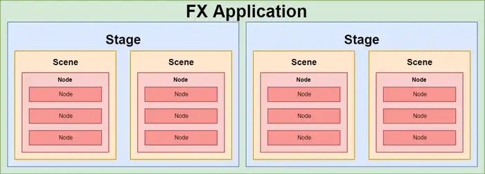

# javafx-notes

**Maven -** a more convenient way of generating the base project structure and contents

- Maven has a built in functionality that allows you to generate a project from a template (it is called **archetype**)
- there is a number of archetypes available which allow you to create various types of projects
    - you can ever create your own archetype and share them with others

**Gradle -** 

**JavaFX SDK**

- is made to use JavaFX locally
- is useful when you are not familiar with Gradle or Maven or just for local development
- when distributing your app, it gets inconvenient as you need to make sure you include all the required dependencies.

# Composition, FXML, controller

- expand

    ### Application composition

    **stage**  = windows

    **scene** = the contents of stage

    **node** = various components of a scene

    

    also:

    

    ### The main class:

    - **class** Main extends **Application** (**javafx.application.Application**)
    - you have to override the abstract **method** from **Application class (public void start(Stage primaryStage) throws Exception)**

    ### The main method:

    - we can launch our application using **Application.launch(**args**)**

    ### Setting up a Stage

    - we already given the primary stage in the start method as an input parameter (Stage primaryStage) in **start method.**
    - BUT it's hidden by default
    - BUT, we can show it using **primaryStage.show()**

    ### Setting the title

    primaryStage.setTitle("Hello world app");

    ### Adding a icon

    ```java
    InputStream iconStream = getClass().getResourceAsStream("/icon.png");
    Image image = new Image(iconStream);
    primaryStage.getIcons().add(image);
    ```

    ### Adding a scene

    - the scene constructor requires already its child node, so we cannot create an empty scene.

    ### Simple app example - without fxml

    ```java
    @Override
    public void start(Stage primaryStage) throws Exception {
        primaryStage.setTitle("Hello world Application");
        primaryStage.setWidth(300);
        primaryStage.setHeight(200);

        InputStream iconStream = getClass().getResourceAsStream("/icon.png");
        Image image = new Image(iconStream);
        primaryStage.getIcons().add(image);

        Label helloWorldLabel = new Label("Hello world!");
        helloWorldLabel.setAlignment(Pos.CENTER);
        Scene primaryScene = new Scene(helloWorldLabel);
        primaryStage.setScene(primaryScene);

        primaryStage.show();
    }
    ```

    - output

        

    ### Few words about FXML

    - there's a lot of design patterns, like MVC (or Model-View-Whatever)
    - it turns out xml's hierarchical structure is a great way to describe a hierarchy of components in the user interface
    - Here you can define all your components and their properties and link it with a Controller, which is responsible for managing interactions.

    ### Changing startup method to work with FXML

    ```java
    FXMLLoader loader = new FXMLLoader();
    URL xmlUrl = getClass().getResource("/mainScene.fxml");
    loader.setLocation(xmlUrl);
    Parent root = loader.load();

    primaryStage.setScene(new Scene(root));
    primaryStage.show();
    ```

    root - the root component of our user interface (the others are nested inside)

    load()

    ### Scripting

    - Scripting

        ### Adding unique ids to our components:

        ```java
        <Label fx:id="mainTitle" text="Hello world!"/>
        ```

        thanks to fx:id you can add scripts to your code (javascript etc.)

        ```java
        <fx:script>
        function buttonClicked() {
            mainButton.setText("Click me again!");
        }
        </fx:script>
        ```

        example with javascript

        ```java
        <?xml version="1.0" encoding="UTF-8"?>
        <?language javascript?>

        <?import javafx.scene.control.Label?>
        <?import javafx.scene.layout.VBox?>
        <?import javafx.scene.control.Button?>

        <VBox xmlns="http://javafx.com/javafx"
              xmlns:fx="http://javafx.com/fxml">
            <Label fx:id="mainTitle" text="Hello world!"/>
            <Label fx:id="subTitle" text="This is a simple demo application."/>
            <Button fx:id="mainButton" text="Click me!" onAction="buttonClicked()"/>
            <fx:script>
                function buttonClicked() {
                    mainButton.setText("Click me again!")
                }
            </fx:script>
        </VBox>
        ```

        The reason why we introduced FXML was a separation of concerns - to decouple UI structure and behavior. With this scripting, the behavior is back again together with our UI structure. What's more - since we are no longer working with Java code but rather XML, we lost all the compile-time checks and type safety. Now all the problems will occur at runtime rather than at compile time. That's very fragile and error-prone.

    ### Adding Controller

    **APPROACH 1: In java - assign it to FXMLLoader - instantiate it yourself**

    ```java
    FXMLLoader loader = new FXMLLoader();
    loader.setController(new MainSceneController());
    ```

    **APPROACH 2: In fxml**

    ```java
    <VBox xmlns="http://javafx.com/javafx"
          xmlns:fx="http://javafx.com/fxml"
          fx:controller="com.vojtechruzicka.MainSceneController">
        ...
    </VBox>
    ```

    If you declare your Controller class in **FXML**, **it is automatically instantiated for you**. This brings one limitation to this approach - you need to have no-args constructor in your Controller so that it can be easily instantiated.

    ```java
    FXMLLoader loader = new FXMLLoader();
    loader.setLocation(getClass().getResource("/mainScene.fxml"));
    MainSceneController controller = loader.getController();
    ```

    ### Calling controller methods

    - so we don't have to use the scripting, we can write button-click logic directly in our controller

    ```java
    public class MainSceneController {
        
        public void buttonClicked() {
            System.out.println("Button clicked!"); //temporarly just show in a terminal
        }
    }
    ```

    - what we do is performing an action, when executing the method linked in button as "onAction"
    - the method has to be set as public, when is not, you can use "@FXML" annotation.

    ```java
    @FXML
    private void buttonClicked() {
        System.out.println("Button clicked!"); //temporarly just show in a terminal
    }
    ```

    - to reference methods from our controller we need to use # before the method name

    ```java
    <VBox xmlns="http://javafx.com/javafx"
          xmlns:fx="http://javafx.com/fxml" fx:controller="com.vojtechruzicka.MainSceneController">
        <Label fx:id="mainTitle" text="Hello world!"/>
        <Label fx:id="subTitle" text="This is a simple demo application."/>
        <Button fx:id="mainButton" text="Click me!" onAction="#buttonClicked"/>
    </VBox>
    ```

    ### Injecting components to Controller

    - this is why we have "fx:id"

    Assume we have the button above with **fx:id="mainButton"**. JavaFX tries to inject this button object to your controller to field with name **mainButton**:

    **Here is injected component with fx:id="mainButton":**

    ```java
    public class MainSceneController {

        .....................
        @FXML
        private Button mainButton;
        ......................
    }
    ```

    ### Injected component and the method - example

    ```java
    public class MainSceneController {

        @FXML
        private Button mainButton;

        @FXML
        private void buttonClicked() {
            mainButton.setText("Click me again!");
        }
    }
    ```

# Layouts

- expand

    Layouts are containers for components

    - this is useful because you can position the whole container no matter what components are inside.
    - each scene can only hold one component, so **layout has to be a root component for the scene**
    - one layout is usually not enough, but you can nest layouts (put one inside another)

    ### Spacing and padding

    

    **Spacing**:

    ```java
    <HBox spacing="10">
         ...
    </HBox>
    ```

    or you can do it directly in java

    ```java
    HBox hbox = new HBox();
    hbox.setSpacing(10);
    ```

    **Padding**:

    ```java
    <HBox>
        <padding>
            <Insets top="10" bottom="10" left="10" right="10"/>
        </padding>
        ...
    </HBox>
    ```

    and alternatively in java:

    ```java
    HBox hbox = new HBox();
    hbox.setPadding(new Insets(10, 10, 10, 10));
    ```

    ## The most straightforward layouts:

    **Hbox** - puts all the items inside horizontally in a row, one after another, from left to right.

    **Vbox** - the same but vertically (in a column)

    **StackPane** 

    - useful for stacking its components one on top of each other
    - the order of insertion determines the order of the items ( the first item is on the bottom, the nest is on top of it and so on)
    - **example**: image and the button on top of it:

    **FlowPane**

    - similar to HBox, but once there is no more horizontal space available, it wraps to the next row under the first one and continues again.

    **TilePane**

    - makes the size of all cells the same depending on the biggest item. This way, all the controls are nicely aligned in rows/columns.

    

    ### More advanced layouts:

    **AnchorPane**

    - allows you to define anchor points to the components inside. (top, bottom, left, right)
    - **example: anchorRight=10** means that the component will keep distance 10 from the right edge of the layout.
    - **example2**: Anchor TOP = 10, RIGHT = 10 means that the component will stay in the top right corner of the layout in the distance 10 from both edges.

    **GridPane**

    - allows you to organize your components into a grid, something as TilePane BUT
    - you need to specify the coordinates of the target location in your grid when adding a new component.

    Example:

    ```java
    <GridPane hgap="10" vgap="10">
        <Label GridPane.rowIndex="0" GridPane.columnIndex="0">First</Label>
        ...
    </GridPane>
    ```

    **Grid cells spacing:**

    - `hgap` sets horizontal spacing (between columns)
    - `vgap` sets vertical spacing (between rows)

    Example:

    ```java
    <GridPane hgap="10" vgap="10">
        ...
    </GridPane>
    ```

    **Spanning multiple cells:**

    ```java
    <GridPane>
        <Label GridPane.columnSpan="2"
               GridPane.rowSpan="2"
               GridPane.rowIndex="0" 
               GridPane.columnIndex="0">
            Foo!
        </Label>
    </GridPane>
    ```

    **Column and row constraints:**

    - Either set percentage of available space for individual rows and columns, or you set preferred width/height.

    ```java
    <GridPane>
        <columnConstraints>
            <ColumnConstraints percentWidth="50" />
            <ColumnConstraints percentWidth="50" />
        </columnConstraints>
        <rowConstraints>
            <RowConstraints percentHeight="50" />
            <RowConstraints percentHeight="50" />
        </rowConstraints>
        ...
    </GridPane>
    ```

    **Absolute size**

    - you can define preferred and minimal size.

    Columns are using **hgrow** property, and rows have **vgrow**. These properties can have three distinct values:

    - `NEVER`: Never grow or shrink on resizing. The default value.
    - `ALWAYS`: When resized, all the elements with this value are either stretched to fill the available space or shrank.
    - `SOMETIMES`: These elements are resized only if there are no other elements with `ALWAYS`.

    **BorderPane**

    - a layout with five sections, that you can assigns elements to

    

# Separating visuals: CSS

- expand
    - There is one special class called **root**. It means the root component of your scene. You can use it to style everything inside your scene (such as setting a global font)
    - all the built-in JavaFX components have already a class assigned out of the box, so if you want to target all labels just use .**label** class, the button with .**button** ec.

    ```css
    .button {
        -fx-font-size: 15px;
    }
    ```

    **Custom classes**

    you can add your own  custom classes to your components, and separate them by coma:

    ```css
    <Label styleClass="my-label,other-class">I am a simple label</Label>
    ```

    - Adding classes this way does not remove the default class of the component (label in this case).

    ## ID

    - it's the unique component's ID.
    - Unlike classes, which can be assigned to multiple components, ID should be unique in a scene.

    ```css
    #my-component {
      ...
    }
    ```

    - In FXML, you can use **fx:id** to set the component's CSS id.
    - For **fx:id** with multiple words, you need, therefore, to use a different naming convention such as CamelCase or use underscores. ( you can not use "-" to separate words as you should in css)

    ```css
    <!--  This is not valid  -->
    <Label fx:id="my-label">I am a simple label</Label>
    <!--  This is valid  -->
    <Label fx:id="my_label">I am a simple label</Label>
    <Label fx:id="MyLabel">I am a simple label</Label>
    ```

    ### Pseudo-classes:

    - marks a state of a component
    - start with : (e.g. :hover) in the CSS selectors

    examples:

    - `hover`: mouse is over the button
    - `focused`: the button has the focus
    - `disabled`: the button is disabled
    - `pressed`: the button is pressed

    ```css
    .button:focused {
        -fx-background-color: red;
    }
    ```

    JavaFX specific pseudo-classes examples:

    - Scrollbars have `horizontal` and `vertical` pseudo-classes
    - Cells have `odd` and `even`
    - TitledPane has `expanded` and `collapsed`

    ### Providing the custom css stylesheet:

    ```css
    <BorderPane xmlns="http://javafx.com/javafx"
                xmlns:fx="http://javafx.com/fxml"
                stylesheets="styles.css"
                ...
                >
      ...
    </BorderPane>
    ```

    or the custom stylesheet just for an individual container:

    ```css
    <HBox stylesheets="styles.css">
        ...
    </HBox>
    ```

    or just on the component level:..(but better to avoid them)

    ```css
    <Label style="-fx-background-color: blue; -fx-text-fill: white">
      I'm feeling blue.
    </Label>
    ```

    ### Stylesheet priorities:

    1. Inline styles
    2. Parent styles
    3. Scene styles
    4. Default styles

# Serialization

**Serialization** is the conversion of **the state of an object** (Java object) ****into a **byte stream** (static stream of bytes that can then be saved to a database or transferred over a network)

**Deserialization** is the opposite

### **There are various ways to achieve that- some of them are:**

1) **XML:** convert Object to XML, ****transfer it over a network or store it in a file/db (in JAVA we use JAXB).

2) **JSON:** same can be done by converting the Object to JSON <JavaScript Object Notation> 

3) The 3rd way to do is to use Serialization that is provided by the OOP language itself. In Java we can do it by making it implement *Serializable interface* and writing to Object Stream.

### The serialization provided by Java:

- the process is instance-indepentent
- classes that are eligible for serialization need to implement a special marker interface **Serializable**
- both of:

**ObjectInputStream** - extends java.io.InputStream

**ObjectOutputStream** - extends java.io.OutputStream

are high-level classes

- the most important method in **ObjectOutputStream** is:

```java
public final void writeObject(Object o) throws IOException;
```

this method takes a serializable **object** and converts it into a **stream of bytes.**

- the most important method in **ObjectInputStream** is

```java
public final Object readObject() throws IOException, ClassNotFoundException;
```

this method read a **stream of bytes** and convert it back into a **Java object**

### Serialization example

- note that ***static fields*** belong to a class and are not serialized
- **also**, we can use keyword *transient* to ignore class fields during serialization

```java
public class Person implements Serializable {
    private static final long serialVersionUID = 1L;
    static String country = "ITALY";
    private int age;
    private String name;
    transient int height;

    // getters and setters
}
```

The test below shows an example of saving an object of type Person to a local file then read this value back in:

```java
@Test 
public void whenSerializingAndDeserializing_ThenObjectIsTheSame() () 
  throws IOException, ClassNotFoundException { 
    Person person = new Person();
    person.setAge(20);
    person.setName("Joe");
    
    FileOutputStream fileOutputStream = new FileOutputStream("yourfile.txt");
    ObjectOutputStream objectOutputStream = new ObjectOutputStream(fileOutputStream);
    objectOutputStream.writeObject(person);
    objectOutputStream.flush();
    objectOutputStream.close();
    
    FileInputStream fileInputStream = new FileInputStream("yourfile.txt");
    ObjectInputStream objectInputStream = new ObjectInputStream(fileInputStream);
    Person p2 = (Person) objectInputStream.readObject();
    objectInputStream.close(); 
 
    assertTrue(p2.getAge() == p.getAge());
    assertTrue(p2.getName().equals(p.getName()));
}
```

### Inheritance and composition:

- when a class implements the *java.io.Serializable* interface, all its sub-classes are serializable as well
- when an object has a reference to another object, these objects must implement the *Serializable* interface separately, or else *NotSerializableException* will be thrown

```java
public class Person implements Serializable {
    private int age;
    private String name;
    private Address country; // must be serializable too
}
```

- Moreover, if one of the fields in a serializable object consists of an array of objects, then all these objects must be serializable as well, or else a NotSerializableException will be thrown.

### Serial Version UID

- what is interesting, the JVM associates a version (long) number with each serializable class.
- the purpose of doing this is verification that the saved and loaded objects have the same attributes and thus are compatible on serialization
- this number is (usually) generated automatically by most IDEs and is based on the class name, its attributes and associated access modifiers.
- any changes result in a different number and can cause an *InvalidClassException*
- if a serializable class doesn't declare a serialVersionUID, the JVM will generate one automatically at run-time, BUT it is highly recommend that each class declares its serialVersionUID **as the generated one is compiler dependent and thus may result in unexpected *InvalidClassExceptions*

### Custom serialization in Java

- java specifies a default way in which objects acan be serialized
- java classes can override this default behavior
- IT IS USEFUL WHEN: trying to serialize an object that has some unserializable attributes
- can be done by providing 2 methods inside the class that we want to serialize (writeObject and readObject)

```java
public class Employee implements Serializable {
    private static final long serialVersionUID = 1L;
    private transient Address address;
    private Person person;

    // setters and getters

    private void writeObject(ObjectOutputStream oos) throws IOException {
        oos.defaultWriteObject();
        oos.writeObject(address.getHouseNumber());
    }

    private void readObject(ObjectInputStream ois) throws ClassNotFoundException, IOException {
        ois.defaultReadObject();
        Integer houseNumber = (Integer) ois.readObject();
        Address a = new Address();
        a.setHouseNumber(houseNumber);
        this.setAddress(a);
    }
}

public class Address {
    private int houseNumber;

    // setters and getters
}
```

- With these methods, we can serialize those unserializable attributes into other forms that can be serialized:

```java
@Test
public void whenCustomSerializingAndDeserializing_ThenObjectIsTheSame() 
  throws IOException, ClassNotFoundException {
    Person p = new Person();
    p.setAge(20);
    p.setName("Joe");

    Address a = new Address();
    a.setHouseNumber(1);

    Employee e = new Employee();
    e.setPerson(p);
    e.setAddress(a);

    FileOutputStream fileOutputStream
      = new FileOutputStream("yourfile2.txt");
    ObjectOutputStream objectOutputStream 
      = new ObjectOutputStream(fileOutputStream);
    objectOutputStream.writeObject(e);
    objectOutputStream.flush();
    objectOutputStream.close();

    FileInputStream fileInputStream 
      = new FileInputStream("yourfile2.txt");
    ObjectInputStream objectInputStream 
      = new ObjectInputStream(fileInputStream);
    Employee e2 = (Employee) objectInputStream.readObject();
    objectInputStream.close();

    assertTrue(
      e2.getPerson().getAge() == e.getPerson().getAge());
    assertTrue(
      e2.getAddress().getHouseNumber() == e.getAddress().getHouseNumber());
}
```

- Note that we must mark the unserializable attributes as transient to avoid the *NotSerializableException*.

# Reflection

**Reflection** is the ability for computer software to inspect its structure(elements such as fields, methods, inner classes etc.) at runtime.

- in Java we achieve this by using the Java Reflection API.

### Retrieving fields from a Class

**Problem**: how to retrieve the fields of a class, regardless of their visibility, later on, the inherited fields as well.

```java
public class Person {
    protected String lastName;
    private String firstName;
}
```

**WHAT**: We want to get both lastName and firstName fields using reflection. 

**HOW**: We'll achieve this by using the Class::**getDeclaredFields** method. As its name suggests, this returns all the declared fields of a class, in the form of a **Field array:**

```java
public class PersonAndEmployeeReflectionUnitTest {

    /* ... constants ... */

    @Test
    public void givenPersonClass_whenGetDeclaredFields_thenTwoFields() {
        Field[] allFields = Person.class.getDeclaredFields();

        assertEquals(2, allFields.length);

        assertTrue(Arrays.stream(allFields).anyMatch(field ->
          field.getName().equals(LAST_NAME_FIELD)
            && field.getType().equals(String.class))
        );
        assertTrue(Arrays.stream(allFields).anyMatch(field ->
          field.getName().equals(FIRST_NAME_FIELD)
            && field.getType().equals(String.class))
        );
    }

}
```

### Retrieving inherited fields

let's create Employee class, that extends Person class(so has lastName and firstName fields as well)

```java
public class Employee extends Person {
    public int employeeId;
}
```

**PROBLEM**: 

Using Employee.class.getDeclaredFields() would only return the *employeeId* field

**SOLUTION IDEA:**

Of course, we could use the getDeclaredFields() method on both Person and Employee classes and merge their results into a single array. **But what if we don't want to explicitly specify the superclass?**

**THE BETTER SOLUTION:** 

We can make use of another method of the Java Reflection API: Class:**:getSuperclass**

This gives us the superclass of another class, without us needing to know what that superclass is.

**So what we do:** 

gather the results of getDeclaredFields() on Employee.class and Employee.class.getSuperclass() and merge them into a single array:

```java
@Test
public void givenEmployeeClass_whenGetDeclaredFieldsOnBothClasses_thenThreeFields() {
    Field[] personFields = Employee.class.getSuperclass().getDeclaredFields();
    Field[] employeeFields = Employee.class.getDeclaredFields();
    Field[] allFields = new Field[employeeFields.length + personFields.length];
    Arrays.setAll(allFields, i -> 
      (i < personFields.length ? personFields[i] : employeeFields[i - personFields.length]));

    assertEquals(3, allFields.length);

    Field lastNameField = allFields[0];
    assertEquals(LAST_NAME_FIELD, lastNameField.getName());
    assertEquals(String.class, lastNameField.getType());

    Field firstNameField = allFields[1];
    assertEquals(FIRST_NAME_FIELD, firstNameField.getName());
    assertEquals(String.class, firstNameField.getType());

    Field employeeIdField = allFields[2];
    assertEquals(EMPLOYEE_ID_FIELD, employeeIdField.getName());
    assertEquals(int.class, employeeIdField.getType());
}
```

### Filtering public and protected Fields

- no method in the Java API allows us to gather public and protected fields
- ClassName::**getFields** method approaches our goal as it returns all public fields of a class and its superclasses, but not the protected ones.
- The only way we have to get only inherited fields is to use the getDeclaredFields() method, as we just did, and filter its results using the Field::getModifiers method

**The output:** an int representing the modifiers of the current field (between 2^0 and 2^7: w^0 public, 2^c static etc) (a sum if more than one)

**Example:** for public static modifiers the result will be 9.

- We're lucky as Java provides us with a utility class to check if modifiers are present in the value returned by getModifiers().**Let's use the isPublic() and isProtected() methods to gather only inherited fields in our example:**

```java
List<Field> personFields = Arrays.stream(Employee.class.getSuperclass().getDeclaredFields())
  .filter(f -> Modifier.isPublic(f.getModifiers()) || Modifier.isProtected(f.getModifiers()))
  .collect(Collectors.toList());

assertEquals(1, personFields.size());

assertTrue(personFields.stream().anyMatch(field ->
  field.getName().equals(LAST_NAME_FIELD)
    && field.getType().equals(String.class))
);
```

- the result doesn't carry the private field anymore.

### Retrieving Inherited Fields on a Deep Class Hierarchy

Let's assume we have a subclass of *Employee* or a superclass of *Person –* then obtaining the fields of the whole hierarchy will require to check all the superclasses.

We can achieve that by creating a utility method that runs through the hierarchy, building the complete result for us:

```java
List<Field> getAllFields(Class clazz) {
    if (clazz == null) {
        return Collections.emptyList();
    }

    List<Field> result = new ArrayList<>(getAllFields(clazz.getSuperclass()));
    List<Field> filteredFields = Arrays.stream(clazz.getDeclaredFields())
      .filter(f -> Modifier.isPublic(f.getModifiers()) || Modifier.isProtected(f.getModifiers()))
      .collect(Collectors.toList());
    result.addAll(filteredFields);
    return result;
}
```

**Example with test:**

```java
public class MonthEmployee extends Employee {
    protected double reward;
}
```

Given all the hierarchy class, our method should give us the following fields definitions: Person::lastName, Employee::employeeId and MonthEmployee::reward.

```java
@Test
public void givenMonthEmployeeClass_whenGetAllFields_thenThreeFields() {
    List<Field> allFields = getAllFields(MonthEmployee.class);

    assertEquals(3, allFields.size());

    assertTrue(allFields.stream().anyMatch(field ->
      field.getName().equals(LAST_NAME_FIELD)
        && field.getType().equals(String.class))
    );
    assertTrue(allFields.stream().anyMatch(field ->
      field.getName().equals(EMPLOYEE_ID_FIELD)
        && field.getType().equals(int.class))
    );
    assertTrue(allFields.stream().anyMatch(field ->
      field.getName().equals(MONTH_EMPLOYEE_REWARD_FIELD)
        && field.getType().equals(double.class))
    );
}
```

# Annotations

Website: [http://tutorials.jenkov.com/java/annotations.html](http://tutorials.jenkov.com/java/annotations.html)

### The purpose

Java annotations are used to provide meta data for your Java code. Being meta data, Java annotations do not directly affect the execution of your code, although some types of annotations can actually be used for that purpose.

Java annotations are typically used for the following purposes:

- Compiler instructions
- Build-time instructions
- Runtime instructions

### Built-In Java annotations

**@Deprecated** 

- is used to mark a class, method or field as deprecated, meaning it should no longer be used.
- If your code uses deprecated classes, methods or fields, the compiler will give you a warning.
- When you use the @Deprecated annotation, it is a good idea to also use the corresponding @deprecated JavaDoc symbol, and explain why the class, method or field is deprecated, and what the programmer should use instead. For instance:

```java
@Deprecated
/**
  @deprecated Use MyNewComponent instead.
*/
public class MyComponent {

}
```

**@Override**

- is used above methods that override methods in a superclass. If the method does not match a method in the superclass, the compiler will give you an error.
- is not necessary in order to override a method in a superclass. It is a good idea to use it still, though. (In case someone changed the name of the overridden method in the superclass, your subclass method would no longer override it. Without the @Override annotation you would not find out.)

**@SuppressWarnings**

- makes the compiler suppress warnings for a given method

## Custom Java Annotation Example

```java
@interface MyAnnotation {

    String   value();

    String   name();
    int      age();
    String[] newNames();

}
```

- Notice the @interface keyword. This signals to the Java compiler that this is a Java annotation definition.

Usage example:

```java
@MyAnnotation(
    value="123",
    name="Jakob",
    age=37,
    newNames={"Jenkov", "Peterson"}
)
public class MyClass {

}
```

# Comparator and Comparable

When working with custom types, or trying to compare objects that aren't directly comparable, we need to make use of a comparison strategy.

### Comparable

- is an interface defining a strategy of comparing an object with other objects of the same type. This is called the class's “natural ordering”.

example:

```java
public class Player implements Comparable<Player> {

	  private int ranking;
    private String name;
    private int age;

    @Override
    public int compareTo(Player otherPlayer) {
        return Integer.compare(getRanking(), otherPlayer.getRanking());
    }

}
```

**The sorting order is decided by the return value of the compareTo() method.**

The Integer.compare(x, y) returns -1 if x is less than y, returns 0 if they're equal, and returns 1 otherwise.

### Comparator

- defines a compare(arg1, arg2) method with two arguments that represent compared objects and works similarly to the Comparable.compareTo() method.

```java
public class PlayerRankingComparator implements Comparator<Player> {

    @Override
    public int compare(Player firstPlayer, Player secondPlayer) {
       return Integer.compare(firstPlayer.getRanking(), secondPlayer.getRanking());
    }

}
```

Similarly, we can create a Comparator to use the age attribute of Player to sort the players:

```java
public class PlayerAgeComparator implements Comparator<Player> {

    @Override
    public int compare(Player firstPlayer, Player secondPlayer) {
       return Integer.compare(firstPlayer.getAge(), secondPlayer.getAge());
    }

}
```

To demonstrate the concept, let's modify our PlayerSorter by introducing a second argument to the Collections.sort method which is actually the instance of Comparator we want to use.

```java
PlayerRankingComparator playerComparator = new PlayerRankingComparator();
Collections.sort(footballTeam, playerComparator);
```

## Java 8 enhancements to the Comparator interface

- using lambda expressions and the comparing() static factory method

Creating ***Comparator***:

```java
Comparator byRanking = 
  (Player player1, Player player2) -> Integer.compare(player1.getRanking(), player2.getRanking());
```

The ***Comparator***.***comparing*** method 

- takes a method calculating the property that will be used for comparing items
- returns a matching Comparator instance

```java
Comparator<Player> byRanking = Comparator
  .comparing(Player::getRanking);
Comparator<Player> byAge = Comparator
  .comparing(Player::getAge);
```

## Comparator vs Comparable

**Comparable**

- is a good choice when used for defining the default ordering - or it it is the main way of comparing objects.

**Comparator**:

- when we can't modify the source code of the class whose objects we want to sort (thus making the use of Comparable impossible)
- when we want to avoid adding additional code to our domain classes
- when we want to define different comparison strategies