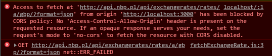

# Currency Converter notes

**Created:** 5.03.2021, **last updated:** 11.03.2021

Dedicated notes for the [currency-converter](http://github.com/gregwell/currency-converter) project.

### Table of contents:
1. [TDD & writing good tests](#tdd--writing-good-tests)
2. [Create-react-app config & JEST tests](#create-react-app-config--jest-tests)
3. [Interaction tests with Testing Library](#interaction-tests-with-testing-library)
4. [Different ways of fetching data from Web API](#different-ways-of-fetching-data-from-web-api)
5. [Dealing with CORS policy](#dealing-with-cors-policy)
6. [Testing asynchronous code](#testing-asynchronous-code)

# TDD & writing good tests

**created:** 5.03.2021**, last updated:** 11.03.2021

> ***Murphy’s Law of Debugging**: The thing you believe so deeply can’t possibly be wrong so you never bother testing it is definitely where you’ll find the bug after you pound your head on your desk and change it only because you’ve tried everything else you can possibly think of.*

### Set of rules:

1. Write a "single" unit test describing an aspect of the program.
2. Run the test, which should fail because the program lacks that feature.
3. Write "just enough" code, the simplest possible, to make the test pass.
4. "Refactor" the code unit it conforms to the simplicity criteria.
5. Repeat, "accumulating" unit tests over time.

### Typical individual mistakes:

1. Forgetting to run tests frequently.
2. Writing too many tests at once.
3. Writing tests that are too large.
4. Writing overly trivial tests, for instance omitting assertions.
5. Writing tests for trivial code, for instance accessors

### Skills:

1. "Test driven bug fixing". When a defect is found, writing a test exposing the defect before correction.

### Write better code thanks to TDD:

([link](https://medium.com/javascript-scene/tdd-changed-my-life-5af0ce099f80))

- **Testing should be done independently of the rest of the application**
    - unit tests force you to test components in isolation from each other, and from I/O.
    - Given some input, the unit under test should produce some known output. If it doesn’t, the test fails. If it does, it passes. The key is that it should do so independent of the rest of the application.
        - If you’re testing state logic, you should be able to test it without rendering anything to the screen or saving anything to a database.
        - If you’re testing UI rendering, you should be able to test it without loading the page in a browser or hitting the network.
- **Keep display components and container components separate in React**
    - keep UI components as minimal as you can.
    - isolate business logic and side-effects from UI.
    - For **display components**, given some props, always render the same state.
        - those components can be easily unit tested to be sure that props are correctly wired up and that any conditional logic in the UI layout works correctly:
            - for example: maybe a list component shouldn’t render at all if the list is empty, and it should instead render an invitation to add some things to the list

### How unit tests are used:

([link](https://medium.com/javascript-scene/what-every-unit-test-needs-f6cd34d9836d))

- **Design aid:** written during design phase, *prior to implementation*.
- **Feature documentation & test of developer understanding:** The test should provide a *clear description of the feature being tested.*
- **QA/Continuous Delivery:** The tests should halt the delivery pipeline on failure and *produce a good bug report when they fail.*

### The most important assertion

*`equal()`*, by nature answers **the two most important questions every unit test must answer**, but most don’t:

- What is the actual output?
- What is the expected output?

### Assign values to variables called `actual` and `expected`

- it makes tests easier to read

### Questions every unit test should answer

1. What component aspect are you testing?
2. What should it do?
3. What is the actual output?
4. What is the expected output?
5. How can the test be reproduced?
    - this question is answered by the code used to derive the `actual` value.
        - note that the `actual` value must be produced by exercising some of the component’s public API.

```jsx
import test from 'tape';

test('What component aspect are you testing?', assert => {
  const actual = 'What is the actual output?';
  const expected = 'What is the expected output?';

  assert.equal(actual, expected,
    'What should the feature do?');

  assert.end();
});
```

For each unit test you write, answer these questions. 

### A unit test example:

```jsx
import test from 'tape';
import compose from '../source/compose';

test('Compose function output type', assert => {
  const actual = typeof compose();
  const expected = 'function';

  assert.equal(actual, expected,
    'compose() should return a function.');

  assert.end();
```

### Saved links:

[https://medium.com/javascript-scene/rethinking-unit-test-assertions-55f59358253f](https://medium.com/javascript-scene/rethinking-unit-test-assertions-55f59358253f)

[https://medium.com/javascript-scene/mocking-is-a-code-smell-944a70c90a6a](https://medium.com/javascript-scene/mocking-is-a-code-smell-944a70c90a6a)

[https://medium.com/javascript-scene/streamline-code-reviews-with-eslint-prettier-6fb817a6b51d](https://medium.com/javascript-scene/streamline-code-reviews-with-eslint-prettier-6fb817a6b51d)

[https://medium.com/javascript-scene/tdd-the-rite-way-53c9b46f45e3](https://medium.com/javascript-scene/tdd-the-rite-way-53c9b46f45e3)

# Create-react-app config & JEST tests

- offers a modern build setup with no configuration
- **You don’t need to install or configure tools like webpack or Babel**. They are preconfigured and hidden so that you can focus on the code.

### Creating an App

- default template

```jsx
npx create-react-app my-app
```

- TypeScript template

```jsx
npx create-react-app my-app --template typescript
```

### Only files inside `src` are processed by webpack

- You need to put any JS and CSS files inside src, otherwise webpack won’t see them.

### Storybook

[https://create-react-app.dev/docs/developing-components-in-isolation](https://create-react-app.dev/docs/developing-components-in-isolation)

### Adding a Stylesheet

- This project setup uses webpack for handling all assets
- webpack offers a custom way of “extending” the concept of import beyond JavaScript
- To express that a JavaScript file depends on a CSS file, you need to import the CSS from the JavaScript file

### Adding other stylesheets, CSS reset etc.

[https://create-react-app.dev/docs/adding-a-css-modules-stylesheet](https://create-react-app.dev/docs/adding-a-css-modules-stylesheet)

[https://create-react-app.dev/docs/adding-a-sass-stylesheet](https://create-react-app.dev/docs/adding-a-sass-stylesheet)

[https://create-react-app.dev/docs/adding-css-reset](https://create-react-app.dev/docs/adding-css-reset)

[https://create-react-app.dev/docs/post-processing-css](https://create-react-app.dev/docs/post-processing-css)

## Tests in create-react-app setup

- Jest is default test runner
- Jest is Node-based runner. This means that the tests always run in a Node environment and not in a real browser.
- Jest is intended to be used for unit tests of your logic and your components rather than the DOM quirks.
- Jest will look for test files with any of the following popular naming conventions:  `.test.js` / `.spec.js` files (or the __tests__ folders) can be located at any depth under the `src` top level folder.

> We recommend to **put the test files** **(or tests folders)** **next to the code they are testing so that relative imports appear shorter.** For example, if App.test.js and App.js are in the same folder, the test only needs to import App from './App' instead of a long relative path. Collocation also helps find tests more quickly in larger projects.

> We recommend **running your tests in watch mode during development.**

# Interaction tests with Testing Library

### Links:

- [https://testing-library.com/docs/queries/about/](https://testing-library.com/docs/queries/about/)
- [https://kentcdodds.com/blog/common-mistakes-with-react-testing-library](https://kentcdodds.com/blog/common-mistakes-with-react-testing-library)
1. Use *ByRole most of the time
2. Use @testing-library/user-event over fireEvent where possible.
3. Avoid adding unnecessary or incorrect accessibility attributes.
4. Only use the query* variants for asserting that an element cannot be found.

    ```jsx
    // ❌
    expect(screen.queryByRole('alert')).toBeInTheDocument()
    // ✅
    expect(screen.getByRole('alert')).toBeInTheDocument()
    expect(screen.queryByRole('alert')).not.toBeInTheDocument()
    ```

# Different ways of fetching data from Web API

[https://betterprogramming.pub/understanding-async-await-in-javascript-1d81bb079b2c](https://betterprogramming.pub/understanding-async-await-in-javascript-1d81bb079b2c)

**Highlights**:

- async functions use an implicit Promise to return results. Even if you don’t return a promise explicitly, the async function makes sure that your code is passed through a promise.
- await blocks the code execution within the async function, of which it (await statement) is a part.
- There can be multiple await statements within a single async function.
- When using async await, make sure to use try catch for error handling.
- Be extra careful when using await within loops and iterators. You might fall into the trap of writing sequentially executing code when it could have been easily done in parallel.
- await is always for a single promise. If you want to await multiple promises (run this promise in parallel) create an array of promises and then pass it to the Promise.all function.

# Dealing with CORS policy



### Proxying API Requests in Development

[https://create-react-app.dev/docs/proxying-api-requests-in-development/](https://create-react-app.dev/docs/proxying-api-requests-in-development/)

# Testing asynchronous code

### **The plan:**

1. **Learn how to mock fetch when testing an app.**
2. **Learn why we shouldn't do it. ([https://kentcdodds.com/blog/stop-mocking-fetch](https://kentcdodds.com/blog/stop-mocking-fetch))**

> mocking with = jest.fn() is a terrible practice. – Estus Flask Dec 1 '20 at 14:57

> To be clear, a correct way to mock an existing global would be jest.spyOn(global, 'fetch')...
