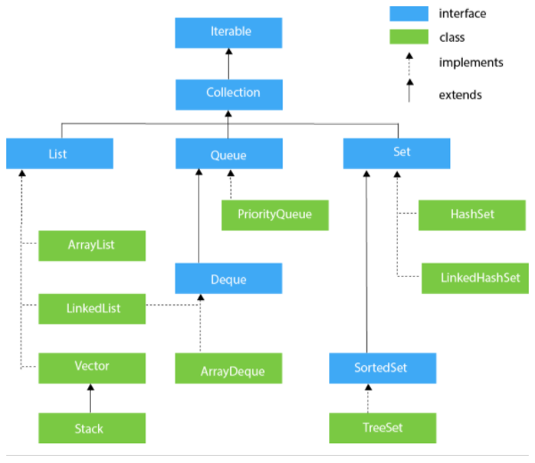

# java

# Interfejsy, klasy abstrakcyjne

*JDK, JRE, JVM – co oznaczają te skróty?*

**JDK à la Java Development Kit -**  środowisko programistyczne do budowania aplikacji i komponentów przy użyciu języka JAVA.

**JRE à la Java Runtime Environment -** zawiera **JVM - Java Virtual Machine**, biblioteki klas i inne piki, które wspierają wywołanie programów napisanych w Java.

**JDK posiada również takie narzędzia jak kompilatory i debuggery. JRE takowych nie posiada.**

**JVM -** można na niej uruchamiać również programy napisane w innych językach programowania (np. Groovy, Kotlin).

*Czym się różni program napisany w C++ od programu w JAVA pod względem kompilacji (kompilacja do kodu bajtowego vs kompilacja do kodu maszynowego, zalety i wady);*

**kompilator** - tłumaczy nasz kod Java do postaci kodu maszynowego, zrozumiałego dla JVM. Kod maszynowy jest zwany **bytecode**.

Ogółem piszemy kod w plikach .java, a kompilator tłumaczy go na bytecode i umieszcza w plikach .class. W IntelliJ IDEA pliki class znajdują się domyślnie w katalogu out. Po kliknięciu takiego pliku i tak widzimy kod w języku Java. Dzieje się tak dzięki procesowi dekompilacji.

- **W przeciwieństwie do C++ gotowe programy, czyli zbiór plików *.class nie są umieszczanie w pliku exe, lecz są pakowane do plików .jar.** Plik jar to tak naprawdę plik typu zip, dlatego bez problemu można go otworzyć i zobaczyć co jest w środku. Dzięki kompresji zajmują mniej miejsca. We wnętrzu pliku jar mogą się także znajdować dodatkowe pliki do wykonania programu.
- kompilacja c/c++ nie czyta żadnych informacji z plików binarnych, ale czyta metody/typy tylko z plików nagłówkowych, które muszą być w całości przeanalizowane.
- kompilatory c++ robią optymalizację, ponieważ żadna inna rzecz ich nie zrobi, w przypadku Javy kompilator jedynie tłumaczy 1:1 kod Javy do bytecode, a JVM zajmuje się resztą.
- w związku z powyższym, w JAVIE mogę sobie skompilować pojedynczą klasę, gdy dodałem małe poprawki, w c++ wszystkie pliki obiektów muszą być zrelinkowane z innymi plikami na wykonywalny kod maszynowy. To możę zając trochę dłużej
- bytecode, czyli kod przetłumaczony z języka JAVA jest przenośny i można go uruchomić na każdej platformie
- zarządzanie pamięcią w cpp jest ręczne, a w Javie zarządzane przez system

*Obiektowość w języku JAVA – pakiety, budowa klasy, definicja konstruktora, metody klas, dostępność składowych, metoda main, przeładowanie nazw metod, domyślne argumenty metod;*

**pakiet** - tworzy pewnego rodzaju "adres", który pomaga zlokalizować klasy w trakcie działania programu. 

- służą do grupowania klas, interfejsów, typów wyliczeniowych, adnotacji
- zwykle używa się odwróconej nazwy domeny, tak jak np. com.agh , najpierw mam com, potem folder agh na dysku i dopiero potem mój katalog projektu.

**Przeciążanie metod:**

Pozwala to najprościej mówiąc na tworzenie metod o takich samych nazwach, ale różnych parametrach

```
class Test{
  int dodaj(int a, int b){
    return a+b;
  }

  double dodaj(double a, double b){
    return a+b;
  }
}
```

*Typy prymitywów w języku JAVA i ich ogólna charakterystyka;*

"prymitywne" typy danych, jak byte,short,int,long,float,double,boolean,char

**Interfejs (jako konstrukcja programistyczna);**

Pojęcie interfejsu można także przenieść do świata programowania. Mówimy wówczas o tak zwanym API (ang. *Application Programming Interface*).

Interfejs w kontekście programowania w języku Java to zestaw metod bez ich implementacji (bez kodu definiującego zachowanie metody)[1](https://www.samouczekprogramisty.pl/interfejsy-w-jezyku-java/#fn:domyslne). Właściwa implementacja metod danego interfejsu znajduje się w klasie implementującej dany interfejs.

W języku Java do definiowania interfejsów używamy słowa kluczowego `interface`. Interfejsy, podobnie jak klasy, definiujemy w osobnych plikach. Nazwa pliku musi odpowiadać nazwie interfejsu.

**Klasa abstrakcyjna;**

podobne jak interfejsy, ale:

- mogą zawierać metody abstrakcyjne, czyli takie, które nie posiadają implementacji (ani nawet nawiasów klamrowych) - np. mam klasę Poruszanie i metodę JedzDoPrzodu, jesli użyję metody abstrakcyjnej tonie muszę definiować z góry sposobu poruszania, dopiero w konkretnej klasie która bedzie tego używała
- może zawierać stałe (zmienne oznaczone jako public static final)

****Konwencja nazewnicza klas, zmiennych i metod. Na zajęciach posługujemy się konwencją zgodną z GJS: [https://google.github.io/styleguide/javaguide.html](https://google.github.io/styleguide/javaguide.html)
Konwencja OBOWIĄZUJE we wszystkich programach (również na kolejnych zajęciach).

# Kolekcje, klasy wewnętrzne, lambda

**Lista**

- jej główną przewagą nad tablicą jest to, że programista nie musi się przejmować rozmiarem listy
- Podstawowymi przykładami implementacji interfejsu java.util.List są klasy java.util.LinkedList oraz java.util.ArrayList.

**Zbiór (Set)**

- przechowuje on unikalne elementy - w odróżnieniu od listy, w zbiorze można przechowywać wyłącznie jedną instancję obiektu.
- Skąd możemy wiedzieć, że dana instancja jest już w zbiorze? Otóż służą do tego opisane już metody hashCode oraz equals.
- Poprawne działanie kolekcji wymaga poprawnie zaimplementowanych metod hashCode/equals.
- nie jest istotna kolejność dodawanych elementów

**Mapa**

- w mapie możemy trzymać klucze, którym odpowiadają wartości.
- jest to odwzorowanie zbioru kluczy na listę wartości
- Klucze muszą być unikalne, wartości mogą się powtarzać
- Kluczami w mapie powinny być obiekty, których nie można zmodyfikować
- Np dobrymi kandydatami na klucze są instancje takich klas jak String czy Integer – są to obiekty, których po zainicjalizowaniu nie możemy zmodyfikować.
- Ponadto klasy kluczy muszą poprawnie implementować metody hashCode/equals.
- Nie implementuje interfejsu Collection, więc nie ma metody add(), jest za to put(K key, V value).

Ogółem:

Głównym ograniczeniem jest to że wraz z kolekcjami opisanymi powyżej nie możesz używać typów prymitywnych (Integer tak, int nie).

a) **Co zyskujemy pisząc** 
*List<String> myList = new ArrayList<>();*  zamiast

*ArrayList<String> myList = new ArrayList<>();*

- napisanie List zamiast ArrayList pokazuje dobrą praktykę.
- polega ona na definiowaniu zmiennych typu interfejsu (List), a nie klasy implementującej ten interfejs (ArrayList)
- pozwala to w przyszłości na przypisanie do zmiennej myList zmienną typu LinkedList<String>, czyli zmienną typu innej klasy implementującej ten interfejs

**b) ArrayList vs LinkedList**

- LinkedList lepiej jest używać jeśli często usuwasz/dodajesz elementy do listy, a ArrayList lepiej jest używać jeśli często chcesz mieć dostęp do losowych elementów w liście znając ich index.

**c) HashMap vs TreeMap vs LinkedHashMap**

**HashMap**

- brak kolejności elementów
- wykorzystuje tablicę mieszaną

**TreeMap** 

- zapewnia również sortowanie na podstawie naturalnego porządku kluczy (wyznaczonego przez implementację interfejsu Comparable lub zdefiniowaniu dodatkowego Comparatora).
- wykorzystuje drzewa czerwono-czarne.

**LinkedHashMap**

- zapewnia zapamiętywanie kolejności dodawania elementów (może to być przydatne podczs iteracji)
- wykorzystuje tablicę mieszaną oraz listę wiązaną

**Porównanie:**

- TreeMap sortuje wg porządku kluczy, a LinkedHashMap po kolejności dodania, HashMap w ogóle nie sortuje

**d) List vs Map vs Set – w jakich przypadkach użyć którą kolekcję?**

Duplikaty:

- List pozwala, Set nie pozwala, Mapa pozwala na zduplikowane wartości lecz nie klucze. (każdy rekord ma klucz i wartość).

Kolejność:

- List tak, Set nie, (ale już LinkedHashSet tak!)

Elementy null:

- List tak, Set tylko jeden, Map tylko jeden klucz null, a wartośc i do woli.

Ogółem, LIST używać gdy chcemy mieć duplikaty i szybki dostęp, SET jak zależy nam na braku duplikatów, a MAP jeśli chcemy mieć strukturę klucz+wartość. 

**e) Interfejs Comparable – jak go używać? jakie problemy rozwiązuje?**

```jsx
public interface Comparable<T> {
    int compareTo(T t);
}
```

- Służy do definiowania strategii porównywania obiektów tego samego typu.
- Zawiera on tylko jedną metodę compareTo().
- W efekcie zaimplementowania Combarable, klasa zyskuje możliwość współdziałania z wieloma generycznymi algorytmami i kolekcjami.

Przykadłowe zyski:

- Dzięki temu kolekcje obiektów implementujących interfejs mogą być sortowane automatycznie (przez Collections.sort). Porządek sortowania jest ustalany na podst. wartości zwróconej przez metodę compareTo().
- Obiekty tak przygotowanej klasy mogą łatwo tworzyć zbiór posortowany automatycznie, z wyeliminowanymi duplikatami w TreeSet. Dodany do takiego drzewa string automatycznie zajmie swoje miejsce w alfabetycznym porządku.

Sama metoda jest używana do porównywania (pod względem leksykalnym), powinna zwrócić:

– liczbę ujemną, gdy pierwszy obiekt jest mniejszy niż porównywany

– 0 gdy obiekty są „równe” (leksykalnie)

– liczbę dodatnią, gdy pierwszy obiekt jest większy niż porównywany

**f) Interfejs Comparator – jak go używać? jakie problemy rozwiązuje?**

- definiuje on metodę compare(arg1, arg2).
- Przydany gdy nie możemy zmodyfikować klas lub chcemy zdefiniować różne strategie porównywania (np. wg kolejności alfabetycznej i numeru pesel w klasie Student)

**h) Czym różni się operator '==' od metody equals()**

- W przypadku operatora '==' porównywana jest przestrzeń pamięci naszej aplikacji. A dokładniej sprawdzane jest czy wartość a i wartość b zapisane są w tym samym miejscu w pamięci naszej wirtualnej maszyny.
- W przypadku metody equals()(przyjmijmy przykład dla zmiennej typu String) porównywana jest wartość (znak po znaku) zmiennej a i b.

**i) Po co używamy adnotacji @Override?**

- kompilator sprawdza czy przeciążamy metodę gdy my myślimy, że to robimy
- kod jest ładniejszy bo jest ocztywiste ze metoda jest przeciażana
- w Java 1.6 można tego użyć żeby zaznaczyć że metoda implementuję interfejs.

**j) Klasa wewnętrzna i anonimowa klasa wewnętrzna**

Klasy wewnętrzne tworzymy i używamy ponieważ:

- Klasy wewnętrzne mogą być ukryte przed innymi klasami pakietu (względy
bezpieczeństwa).
- Klasy wewnętrzne pozwalają unikać kolizji nazw (np. klasa wewnętrzna
nazwana Vector nie koliduje nazwą z klasą zewnętrzną o tej samej
nazwie).
- Klasy wewnętrzne (w szczególności anonimowe) są intensywnie używane
przy implementacji standardowych interfejsów Javy.
- Anonimowe klasy wewnętrzne pozwalają na traktowanie fragmentów kodu
do wykonania (ściślej: metod przedefiniowywanych w tych klasach) jak
obiektów, a wobec tego np. umieszczanie ich w tablicach, kolekcjach, czy
przekazywanie innym metodom jako argumentów.
- Do statycznej klasy wewnętrznej mamy dostęp poprzez nazwę klasy
otaczającej **OuterClass**.**StaticNestedClass**
- Między obiektami statycznej klasy wewnętrznej a obiektami klasy otaczającej
nie zachodzą żadne związki.

**Ważne**:

- Tworzenie obiektu niestatycznej klasy wewnętrznej wymaga zawsze
istnienia obiektu klasy otaczającej. Mówi się, że obiekt klasy wewnętrznej
opiera się na obiekcie klasy otaczającej. Dlatego tworzymy najpierw obiekt
klasy otaczającej

```java
OuterClass outerObject = new OuterClass();
OuterClass.InnerClass innerObject =
outerObject.new InnerClass();
```

lub jeśli nie potrzebujemy obiektu klasy zewnętrznej:

```java
OuterClass.InnerClass innerObject = new OuterClass().new
InnerClass();
```

Wewnątrz klasy otaczającej (OuterClass) tam, gdzie dostępne jest this,
można po prostu napisać:

```java
InnerClass innerObject = new InnerClass();
```

### **Anonimowe klasy wewnętrzne.**

Klasy te nie mają nazwy.
Najczęściej tworzymy je po to, by przedefiniować jakieś metody klasy bazowej
przez klasę wewnętrzną bądź zdefiniować metody implementowanego przez nią
interfejsu na użytek jednego obiektu. Referencję do tego obiektu chcemy
traktować jako typu klasy bazowej lub typu implementowanego interfejsu.
Nazwa takiej klasy wewnętrznej jest więc nam niepotrzebna i nie chcemy jej
wymyślać. Wtedy stosujemy anonimowe klasy wewnętrzne.

**Definicja anonimowej klasy wewnętrznej:**

```java
new NazwaTypu( parametry ) {
 // pola i metody klasy wewnętrznej
 }
```

gdzie:

***NazwaTypu*** – nazwa nadklasy (klasy dziedziczonej w klasie wewnętrznej)
lub implementowanego przez klasę wewnętrzną interfejsu,
***parametry*** – argumenty przekazywane konstruktorowi nadklasy; w
przypadku, gdy Typ jest nazwą interfejsu lista parametrów jest oczywiście
pusta (bo chodzi o implementację interfejsu).

Uwagi:

- anonimowe klasy wewnętrzne nie mogą mieć konstruktorów (bo nie mają nazwy),
- za pomocą anonimowej klasy wewnętrznej można stworzyć tylko jeden obiekt, bo
definicja klasy podana jest w wyrażeniu new czyli przy tworzeniu obiektu, a nie
mając nazwy klasy nie możemy potem tworzyć innych obiektów; jeśli jednak to
wyrażenie new umieścimy np. w pętli – to oczywiście stworzone zostanie tyle
obiektów ile razy wykona się pętla,
- definiowanie klas wewnętrznych implementujących interfejsy stanowi jedyny
dopuszczalny przypadek użycia nazwy interfejsu w wyrażeniu new
- anonimowe klasy wewnętrzne są kompilowane do plików .class o nazwach
automatycznie nadawanych przez kompilator (nazwa składa się z nazwy klasy
otaczającej i jakiegoś automatycznie nadawanego identyfikatora)

### Definiowanie klas wewnętrznych

Klasy wewnętrzne (nazwane i anonimowe) mogą być definiowane w blokach
lokalnych (np. w ciele metody). Będziemy je krótko nazywać klasami lokalnymi.
Wewnętrzne klasy lokalne są doskonale odseparowane (nie ma do nich żadnego
dostępu spoza bloku, w którym są zdefiniowane), a mogą odwoływać się do
składowych klasy otaczającej oraz zmiennych lokalnych zadeklarowanych w bloku
(pod warunkiem, że są one niezmienne).

Ciekawe przykłady implementacji klas wewnętrznych - [link](https://pracownik.kul.pl/files/10382/public/w6_1.pdf)

### k) Wyrażenia lambda

- W prostych słowach wyrażenia lambda to funkcje anonimowe. Nie określałbym ich metodami, bo lambda wcale nie przynależy do konkretnej klasy jak metody w języku Java.

Przykłady:

- funkcja bez nazwy np:

```java
(int a, int b) -> a + b;
```

- nie musi posiadać typów parametrów

```java
(a, b) -> a + b;
```

- nie musi posiadać parametrów

```java
() -> 1 + 1;
```

- nie musi posiadać czegokolwiek (WTF)

```java
() -> {};
```

- może coś zwracać

```java
() -> {return 1 + 1;};
```

- może coś zwracać nawet bez return;

```java
() -> 1+1;
```

- może nic nie zwracać

```java
() -> System.out.println("Lambda");
```

- można ją przypisać do zmiennej

```java
Runnable runnable = () -> {};
```

- zmienną można przekazać do metody:

```java
runTask(runnable);
```

**TERAZ UWAGA:** Powoływanie do życia lambdy:

```java
InterfaceCalculation add = (a, b) -> a + b;
```

Po lewej stronie mamy nazwę interfejsu funkcjonalnego, który wygląda tak:

```java
@FunctionalInterface
interface InterfaceCalculation {

    int calculation(int a, int b);
}
```

Jest on niezbędny, żeby mogła powstać nasza funkcja anonimowa (lambda).

## Typy wyliczeniowe - enum

Wyobraź sobie, że mamy klasę Tshirt, która posiada kilka atrybutów takich jak kolor, rozmiar czy producent. O ile producentów koszulek, podobnie jak ich kolorów jest dość dużo to rozmiary są już bardzo często wspólne dla różnych producentów. Rozmiary możemy wyliczyć: S, M, L czy XL. I właśnie do przechowywania danych tego typu Java ma specjalny typ. Jest to enum zwany także typem wyliczeniowym.

- Konwencja nadawania nazw zaleca aby wartości dla typu enum pisane były drukowanymi literami.

```java
public enum TshirtSize {
    S,
    M,
    L,
    XL
}
```

- Typ wyliczeniowy to też klasa

### Kolekcje w Javie

- to framework, który zapewnia architekturę to przechowywania i manipulowania grupą obiektów.
- mogą osiągnąć wszystkie operacje jakie przeprowadzasz na danych takie jak szukanie, sortowanie, wpisywanie, manipulacja i edycja.
- oznacza pojedynczą jednostkę obiektów. Cały framework Java Collection zapewnia wiele intwerfejsów (Set, List, Queue, Deque) i klas(ArrayList, Vector, LinkedList, PriorityQueue, HashSet, LinkedHashSet, TreeSet)

### Co to w ogóle framework w Javie

- zapewnia gotową do użytku architekturę
- reprezentuje zbiór klas i interfejsów
- jest całkowicie opcjonalny

### Collection framework posiada

1. Interfejsy i ich implementacje np. klasy
2. Algorytm

## Hierarchia Collection Framework



## Implementacja:

### Zadanie 1: wzorzec projektowy strategia + 5 metod sortowania

- [ ]  zastosować wzorzec projektowy strategia
- [ ]  stworzyć klasę dla każdego sortowania (5 różnych)
- [ ]  wypełnić tablice albo randomowo albo optymistycznie(po kolei), albo pesymistycznie (na odwrót)
- [ ]  dla każdego wypisać czas sortowania
- [ ]  czas liczyć tak, że mam czas na wejściu i czas na wyjściu i odejmuje te czasy
- [ ]  wynikiem ma być dla każdego sortowania zmierzony czas dla wersji pes. , opt. i oczekiwanej.

### Zadanie 2: napisać metodę spot..

```java
int[]spot(List<Integer> a, int target)
```

- Założenie; Każdy element listy jest liczbą całkowitą z przedziału [−1000000..1000000] i może obejmować dowolną ilość powtórzeń.
- otrzymuje ona listę (ew. tablicę) N liczb całkowitych i  zwraca pozycję dwóch elementów, których iloczyn będzie równy wskazanej w argumentach liczby
- użyć dwa fory żeby złożność obliczeniowa była równa O(n^2)
- jeśli problem nie posiada rozwiązania najlepiej wyrzucić wyjątek = wyjątek wlasny jako rozszerzenie interfejsu exception, tak samo jak za króka tablica

### Zadanie 3: napisać metodę intsubstring...

```java
intsubstring(String a, String b)
```

- zwracać ma liczę powtórzeń łańcucha a aby b stał się podłańcuchem a (zawierał się w nim)
- jeżeli b nie może być podłańcuchem a to zwróć -1.

Przykład

```java
a="abcd", b="cdabcdab" => 3
```

ponieważ dopiero trzy powtórzenia **a** dadzą "ab**cdabcdab**cd" który zawiera łańcuch **b.**

### Zadanie 4: znaleźć 3 takie liczby których suma będzie największa.. (mając do dyspozycji listę liczb całkowitych)

```java
int[] tab = { -5, -7, 10, 1 };
System.out.println(maxTriplet(tab)); // 6
//Wynik: 6 = -5 + 10 + 1
```

### Zadanie 5: Dana jest macierz o wymiarach *n* oraz *m*. Wypisz elementy macierzy jako spirala przeciwnie do kierunku ruchu wskazowek zegara.

Pytania:

- Każdy wyjątek w języku Java dziedziczy po klasie Throwable .
- główne powody do stosowania własnych wyjątków to takie związane z businessem, bo większość jest obejmowana przez Exceptions


**Error:**

An Error indicates serious problem that a reasonable application should not try to catch.

**Exception:**

Exception indicates conditions that a reasonable application might try to catch.

**Do czego służy object** 

- to klasa rodzic dla kazdej innej klasy
- przydaj sie gdy chcemy sie odniesc do obiektu ktorego typu nie znamy, parent class może pokazywać dalej dziecko np . mozna uzyc getObject(); ale nie wiemy jaki obiekt bedzie zwrócony
- pozwala np. .toString() zmienic obiekt w stringa
- albo porownac equals
- albo getClass