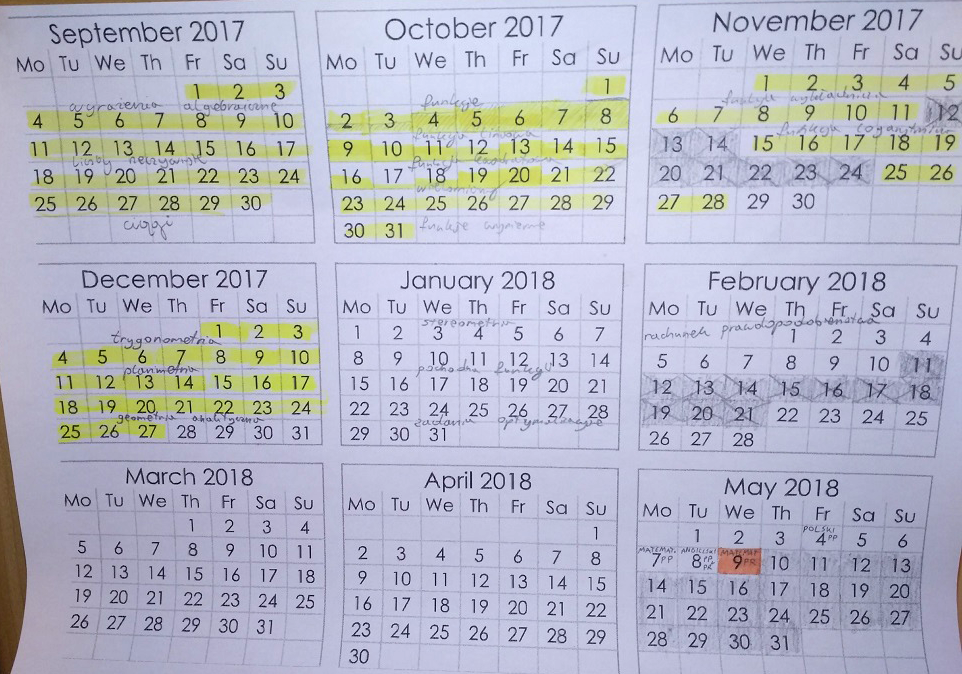
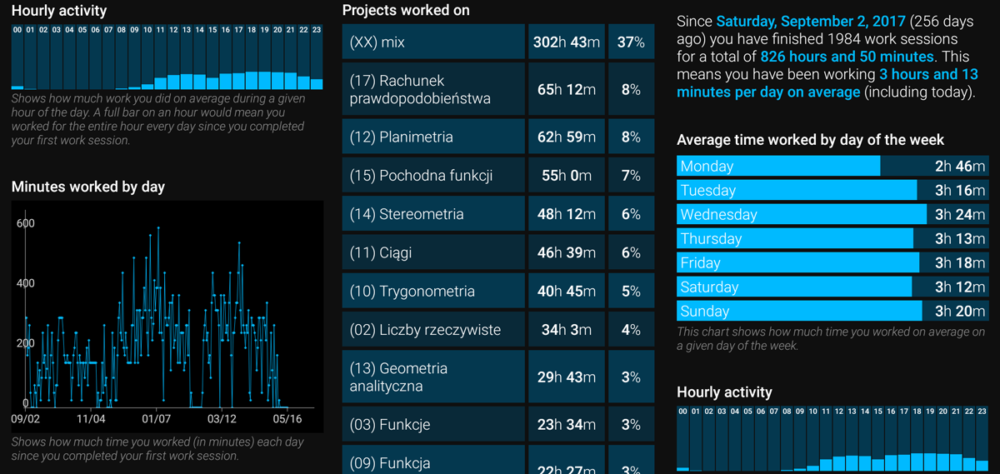

# Matematyka Matura

- Ten katalog zawiera wszystkie notatki wykonane podczas przygotowania do matury z matematyki (praktycznie od zera) w okresie Wrzesień 2017 - Kwiecień 2018
- Struktura notatek jest zaczerpnięta z kolejności rozdziałów z książki "Matura z matematyki" Andrzeja Kiełbasy
- Rekomendacja dla przyszłych pokoleń: nie ma lepszego źródła do nauki niż [zadania.info](https://zadania.info/)

- 📂 __matematyka\-matura__
    - 📄 [1. Algebra](src/01%20Algebra.pdf)
    - 📄 [2. Liczby rzeczywiste](src/02%20Liczby%20rzeczywiste.pdf)
    - 📄 [3. Funkcje](src/03%20Funkcje.pdf)
    - 📄 [4. Funkcja liniowa](src/04%20Funkcja%20liniowa.pdf)
    - 📄 [5. Funkcja kwadratowa](src/05%20Funkcja%20kwadratowa.pdf)
    - 📄 [6. Wielomiany](src/06%20Wielomiany.pdf)
    - 📄 [7. Funkcje wymierne](src/07%20Funkcje%20wymierne.pdf)
    - 📄 [8. Funkcja wykładnicza](src/08%20Funkcja%20wyk%C5%82adnicza.pdf)
    - 📄 [9. Funkcja logarytmiczna](src/09%20Funkcja%20logarytmiczna.pdf)
    - 📄 [10. Trygonometria](src/10%20Trygonometria.pdf)
    - 📄 [11. Ciągi](src/11%20Ci%C4%85gi.pdf)
    - 📄 [12. Planimetria](src/12%20Planimetria.pdf)
    - 📄 [13. Geometria analityczna](src/13%20geo%20analityczna.pdf)
    - 📄 [14. Stereometria](src/14%20Stereometria.pdf)
    - 📄 [15. Pochodna](src/15%20Pochodna.pdf)
    - 📄 [17. Rachunek prawdopodobienstwa](src/17%20Rachunek%20prawdopodobienstwa.pdf)
    - 📄 [Pro tipy](src/X%20pro%20tipy.pdf)
    - 🗺️ [Mapa funkcji](src/XX%20mapa%20funkcji.pdf)

### Plan nauki:

### Statystyki:

