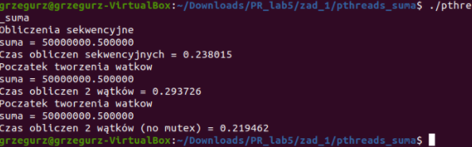

# Parallel Programming Reports

This file contains the merged class reports **with the code attached**. (in Polish 😐)

# **Sprawozdanie z Laboratorium 1.**

**Cel:**
- przeprowadzenie pomiaru czasu CPU i zegarowego wykonania operacji
- organizacja środowiska tworzenia oprogramowania w systemie Linux (make, cc itp.)

**Wykonanie następujących ćwiczeń:**

1. Skopiowanie wskazanych plików tj. Makefile, pomiar_czasu.c, pomiar_czasu.h, moj_program.c) do katalogu roboczego lab_1.
2. Modyfikacja pliku źródłowego *moj_program.c* umieszczając wywołania prodecur pomiaru i wydruku czasu. (plik w załączniku nr 1.)
3. Modyfikacja pliku *Makefile* tak aby poprawnie tworzyć plik binarny moj_program poprzez:
- dodanie plików *moj_program.c, pomiar_czasu.h* w linii zależności pliku *moj_program.o*
- wpisanie polecenia kompilacji z odpowiedniemi opcjami pliku źródłowego moj_program.c (plik stanowi załącznik 2.)

4. Uruchomienie kodu.

5. Analiza czasów wykonania przedstawia się następująco:

- czas wykonania 100000 operacji arytmetycznych mnożenia:

    czas CPU: 0.005704, czas zegarowy: 0.017513

- czas wykonania 100000 operacji wejscia/wyjscia:

    czas CPU: 0.005536, czas zegarowy: 0.061648

W ramach zadań dodatkowych zrealizowano:

1. Przeniesienie plików związanych z pomiarem czasu do odrębnego katalogu pomiar_czasu.
2. W katalogu pomiar_czasu utworzono bibliotekę libpomiar_czasu.a z pliku pomiar_czasu.o poleceniem ar -rs libpomiar_czasu.a pomiar_czasu.o
3. Zmodyfikowano plik Makefile tak aby zamiast plikow źródłowych i pośrednich pomiaru czasu korzystał z biblioteki:
- usunąłem odniesienia do plików pomiar_czasu.c i pomiar_czasu.o
- Nadano własciwe wartości symbolom LIB i INC.
- Dodano właściwe wykorzsytanie symobli LIB i INC w trakcie kompilacji.

**Wnioski:**

1. Wykorzystanie makefile ułatwia pracę i tworzenie kodu binarnego z plików źródłowych.
2. Pomiar czasu wykazał, że operacje wejśćia/wyjścia zajmują więcej czasu zegarowego aniżeli operacje arytmetyczne. 
3. Pomiar czasu wykazał, że czas wykonania przez CPU jest podobny w obu typach operacji, jednak czekać musimy dłużej na wykonanie operacji przez twardy dysk, stąd taka różnica w czasie.
4. W moim przypadku wersja zoptymalizowana nie wykazała wielkich zmian w stosunku do wersji do debugowania.

Załącznik 1. Plik moj_program.c

```jsx
#include<stdlib.h>
#include<stdio.h>
#include<time.h>
#include "pomiar_czasu.h"
 
const int liczba = 100000;

main(){

  double a, b, c;
  int i,j,k,l;
  double t1;
  double t2;

  k = -50000;

  inicjuj_czas();
  for(i=0;i<liczba;i++){

    printf("%d ",k+i);

  }
  drukuj_czas();
	
  printf("\n");

  printf("Czas wykonania %d operacji wejscia/wyjscia: \n",liczba);

  a = 1.000001;

  t1=czas_zegara();
  t2=czas_CPU();
  for(i=0;i<liczba;i++){

    a = 1.000001*a+0.000001; 

  }
  t1=czas_zegara()-t1;
  t2=czas_CPU()-t2;

  printf("Wynik operacji arytmetycznych: %lf\n", a);
  printf("Czas wykonania %d operacji arytmetycznych: \n",liczba);

  printf("Czas zegara t1= %lf \n", t1);
  printf("czas cpu t2 = %lf \n", t2);

}
```

Załącznik 2. Plik Makefile

```jsx
# kompilator c
CCOMP = gcc

# konsolidator
LOADER = gcc

# opcje optymalizacji:
# wersja do debugowania
# OPT = -g -DDEBUG
# wersja zoptymalizowana do mierzenia czasu
OPT = -O3

# pliki naglowkowe
INC = -I../pomiar_czasu

# biblioteki
LIB = -L../pomiar_czasu -lm

# zaleznosci i komendy
moj_program: moj_program.o pomiar_czasu.o
	$(LOADER) $(OPT) moj_program.o pomiar_czasu.o -o moj_program $(LIB)

# jak uzyskac plik moj_program.o ?
moj_program.o: moj_program.c 
	$(CCOMP) -c $(OPT) moj_program.c $(INC)
	
pomiar_czasu.o: pomiar_czasu.c pomiar_czasu.h
	$(CCOMP) -c $(OPT) pomiar_czasu.c

clean:
	rm -f *.o
```

# **Sprawozdanie z laboratorium 5.**

6.11.2020, godz. 8:00

### Cel:

Celem laboratorium było nabycie umiejętności tworzenia i implementacji programów równoległych w środowisku **Pthreads**.

### Wykonanie:

W ramach zajęć zrealizowałem następujące kroki:

- Utworzyłem katalog roboczy lab_5
- Skopiowalem ze strony przedmiotu paczkę ***pthreads_suma.tgz,*** którą rozpakowalem następnie w podkatalogu zad_1
- Skopiwałem ze strony przedmiotu paczkę ***libpomiar_czasu.tgz,*** którą użyłem jako biblioteki pomiaru czasu, portrzebnej do działania programu.
- Uruchomiłem i przetestowałem działanie dla różnej liczby wątków



Uruchomienie 1.


Uruchomienie 2.

**Jak wygląda prosty wzorzec zrównoleglenia pętli?**

Gdy rozpatrujemy zrównoleglanie, ze względu na skalę w jakiej się ono odbywa możemy rozróżnić obliczenia równoległe na poziomie bitów, instrukcji, **danych** oraz zadań.

**Zrównoleglanie na poziomie przetwarzania danych** 

- jest właściwe przetwarzaniu iteracyjnemu i skupia się na rozdzielaniu danych pomiędzy różne jednostki obliczeniowe w taki sposób aby zminimalizować ich wzajemne zależności
- Rozdzielenie danych nie zawsze jest możliwe. Jeśli na przykład obliczenia w każdej kolejnej iteracji zależą od wyników poprzedniej, to zrównoleglenie pętli nie jest możliwe.
- każdy wątek/proces
    - otrzymuje pewną liczbę iteracji pętli do wykonania
    - posiada własny indeks iteracji
    - wykonanie jest najczęściej synchroniczne

W naszym przykładzie **każdy wątek** otrzymuje fragment całki do policzenia, co przeskok równy liczbie wątków.

```objectivec
int i; 
double calka = 0.0; 
for(i=my_start; i<my_end; i+=my_stride){ 
double x1 = a + i*dx; 
calka += 0.5*dx*(funkcja(x1)+funkcja(x1+dx));
} 
pthread_mutex_lock(&muteks);
calka_global += calka; 
pthread_mutex_unlock(&muteks); 
pthread_exit((void*)0)
```

- W zadaniu obliczania sumy tablicy całą tablicę przesyłamy z pamięci do rdzeni procesora
- Mimo zwiększania liczby wątków czasy w pewnym momencie przestają się zmniejszać - dzieje się to ze względu na ograniczoną przepustowość magistrali
- Czas obliczeń w wersji rozdzielonej na wątki i w wersji synchronicznej jest bardzo podobny.
- Wyścig przy sumowaniu ostatecznego wyniku można wyeliminować stosując muteksy oraz sekcję krytyczną w której sumujemy wynik.

### Część dalsza

- Pobrano pliku ***pthreads_calka.c*** i ***Makefile***
- dodano do programu wariant obliczania całki w sposób wielowątkowy przy użyciu wzorca zrównoleglenia pętli
- zastosowano cykliczny wariant dekompozycji pętli
- program główny wywołuje funkcje całka_zrownoleglenie_petli, która zwraca wartość obliczonej całki
- dodano do programu wariant obliczania całki w sposób wielowątkowy przy użyciu wzorca dekompozycji w dziedzinie problemu
- w utworzonej wersji dekompozycji wątku tworzona jest tablica o typie struktury, w której przechowujemy dane potrzebne do całkowania dla poszczególnego wątku.
- każdy wątek dostaje równy obszar działania
- obliczane jest N i poprawiane dx.
- Tworzymy wątki , bez synchronizacji. Nie używamy muteksów.
- Wynik w tej wersji różni się od wyniku z wersji sekwencyjnej ponieważ wartość dx dla wersji sekwencyjnej obliczamy z całego przedziału całkowania a w tej wersji dx liczymy osobno dla każdego obszaru działania tego wątku.


pthreads_calka.c

```objectivec
#include<stdlib.h>
#include<stdio.h>
#include<pthread.h>
#include<math.h>
#include"pomiar_czasu.h"
double funkcja ( double x );
double funkcja ( double x ){ return( sin(x) ); }
double calka_sekw(double a, double b, double dx, int N);
double calka_zrownoleglenie_petli(double a, double b, double dx, int N);
double calka_dekompozycja_obszaru(double a, double b, double dx, int N);
pthread_mutex_t muteks;
#define LICZBA_W_MAX 1000
int l_w_global=0;
struct dane{
 double a, b, dx, wynik;
 int N, id;
};
int main( int argc, char *argv[] ){
 int i; 
 double t1,t2,t3;
 double a, b, dx, calka;
 
 printf("\nProgram obliczania całki z funkcji (sinus) metodą trapezów.\n");
 a = 0.0;
 //printf("\nPodaj lewy kraniec przedziału całkowania: "); scanf("%lf", &a);
 b = M_PI;
 //printf("\nPodaj prawy kraniec przedziału całkowania: "); scanf("%lf", &b);
 printf("\nPodaj wysokość pojedynczego trapezu: "); scanf("%lf", &dx);
 int N = ceil((b-a)/dx);
 double dx_adjust = (b-a)/N;
 printf("Obliczona liczba trapezów: N = %d\n", N);
 printf("\nPodaj liczbę wątków: "); scanf("%d", &l_w_global);
 printf("\nPoczatek obliczeń sekwencyjnych\n");
 printf("a %lf, b %lf, n %d, dx %.12lf (dx_adjust %.12lf)\n", a, b, N, dx, dx_adjust);
 t1 = czas_zegara();
 calka = calka_sekw(a, b, dx_adjust, N);
 t1 = czas_zegara() - t1;
 printf("\nKoniec obliczen sekwencyjnych\n");
 printf("\tCzas wykonania %lf. \tObliczona całka = %.15lf\n", t1, calka);
 printf("\nPoczatek obliczeń równoległych (zrównoleglenie pętli)\n");
 printf("a %lf, b %lf, n %d, dx %.12lf (dx_adjust %.12lf)\n", a, b, N, dx, dx_adjust);
 t1 = czas_zegara();
 calka = calka_zrownoleglenie_petli(a, b, dx_adjust, N);
 pthread_mutex_init(&muteks,NULL);
 t1 = czas_zegara() - t1;
 printf("\nKoniec obliczen równoległych (zrównoleglenie pętli) \n");
 printf("\tCzas wykonania %lf. \tObliczona całka = %.15lf\n", t1, calka);
 printf("\nPoczatek obliczeń równoległych (dekompozycja obszaru)\n");
 printf("a %lf, b %lf, n %d, dx %.12lf (dx_adjust %.12lf)\n", a, b, N, dx, dx_adjust);
 t1 = czas_zegara();
 calka = calka_dekompozycja_obszaru(a, b, dx_adjust, N);
 t1 = czas_zegara() - t1;
 printf("\nKoniec obliczen równoległych (dekompozycja obszaru) \n");
 printf("\tCzas wykonania %lf. \tObliczona całka = %.15lf\n", t1, calka);
}
double calka_sekw(double a, double b, double dx, int N){
 int i;
 double calka = 0.0;
 for(i=0; i<N; i++){
 double x1 = a + i*dx;
 calka += 0.5*dx*(funkcja(x1)+funkcja(x1+dx));
 //printf("i %d, x1 %lf, funkcja(x1) %lf, całka = %.15lf\n",
 // i, x1, funkcja(x1), calka);
 }
 return(calka);
}
static double calka_global=0.0;
static double a_global;
static double b_global;
static double dx_global;
static int N_global;
void* calka_fragment_petli_w(void* arg_wsk);
double calka_zrownoleglenie_petli(double a, double b, double dx, int N){
 //printf("a %lf, b %lf, dx %lf, n %d\n", a, b, dx, N);
 int l_w = l_w_global;
 a_global = a;
 b_global = b;
 dx_global = dx;
 N_global = N;
 //printf("\nPodaj liczbę wątków: "); scanf("%d", &l_w);
 // tworzenie struktur danych do obsługi wielowątkowości
 pthread_t tid[l_w];
 int id[l_w];
 int i;
 // tworzenie wątków
 for(i=0;i<l_w;i++)
 {
id[i]=i;
 }
 for(i=0;i<l_w;i++)
 {
pthread_create(&tid[i], NULL, calka_fragment_petli_w, &id[i]);
 }
 // oczekiwanie na zakończenie pracy wątków
 for(i=0;i<l_w;i++)
 {
pthread_join(tid[i],NULL);
 }
 return(calka_global);
}
void* calka_fragment_petli_w(void* arg_wsk){
 int my_id;
 my_id = *((int*)arg_wsk);
 double a, b, dx; // skąd pobrać dane a, b, dx, N, l_w ?
 int N, l_w; // wariant 1 - globalne
 
 // a = a_global; // itd. itp. - wartości globalne nadaje calka_zrownoleglenie_petli
 a = a_global;
 b = b_global;
 dx = dx_global;
 N = N_global;
 l_w = l_w_global;
 int my_start = my_id;
 int my_end = N;
 int my_stride = l_w;
 // something else ?
 
 //printf("%d", N);
 printf("\nWątek %d\n", my_id);
 printf("my_start %d, my_end %d, my_stride %d\n",
my_start, my_end, my_stride);
 int i;
 double calka = 0.0;
 for(i=my_start; i<my_end; i+=my_stride){
 double x1 = a + i*dx;
 calka += 0.5*dx*(funkcja(x1)+funkcja(x1+dx));
 //printf("i %d, x1 %lf, funkcja(x1) %lf, całka = %.15lf\n",
 // i, x1, funkcja(x1), calka);
 }
 
 pthread_mutex_lock(&muteks);
 calka_global += calka;
 pthread_mutex_unlock(&muteks);
 pthread_exit((void*)0);
}
void* calka_podobszar_w(void* arg_wsk);
double calka_dekompozycja_obszaru(double a, double b, double dx, int N){
 //printf("a %lf, b %lf, dx %lf, n %d\n", a, b, dx, N);
 int l_w = l_w_global;
 //printf("\nPodaj liczbę wątków: "); scanf("%d", &l_w);
 double calka_suma_local = 0.0;
 // tworzenie struktur danych do obsługi wielowątkowości
 pthread_t tid[l_w_global];
 struct dane *tab;
 double obszar_watku = (b-a)/l_w_global;
 tab = (struct dane *)malloc(l_w_global*sizeof(struct dane));
 
 for(int i = 0; i<l_w_global; i++)
 {
 tab[i].a = obszar_watku*i;
 tab[i].b = tab[i].a+obszar_watku;
 tab[i].dx = 0.0001;
 tab[i].N = ceil((tab[i].b - tab[i].a)/tab[i].dx);
 tab[i].dx = (tab[i].b - tab[i].a)/tab[i].N;
 tab[i].id = i;
 }
 // tworzenie wątków
 for(int i=0;i<l_w;i++)
 {
pthread_create(&tid[i], NULL, calka_podobszar_w, &tab[i]);
 }
 // oczekiwanie na zakończenie pracy wątków
 for(int i=0;i<l_w;i++)
 {
pthread_join(tid[i],NULL);
 }
 for(int i = 0; i<l_w_global;i++)
 {
 calka_suma_local+=tab[i].wynik;
 }
 return(calka_suma_local);
}
void* calka_podobszar_w(void* arg_wsk){
 double a_local, b_local, dx_local;
 int N_local;
 int my_id;
 struct dane *struktura = arg_wsk;
 a_local = struktura -> a;
 b_local = struktura -> b;
 dx_local = struktura -> dx;
 N_local = struktura -> N;
 my_id = struktura -> id;
 
 printf("\nWątek %d\n", my_id);
 printf("a_local %lf, b_local %lf, dx_local %lf, n_local %d\n",
a_local, b_local, dx_local, N_local);
 int i;
 double calka = 0.0;
 for(i=0; i<N_local; i++){
 double x1 = a_local + i*dx_local;
 calka += 0.5*dx_local*(funkcja(x1)+funkcja(x1+dx_local));
 //printf("i %d, x1 %lf, funkcja(x1) %lf, całka = %.15lf\n",
 //i, x1, funkcja(x1), calka);
 }
 
 struktura -> wynik = calka;
}
```

# **Sprawozdanie z laboratorium 6.**

13.11.2020, godz. 8:00 (piątek)

Wersja 2 - poprawiona.

### Cel:

Celem laboratorium było opanowanie **podstaw tworzenia wątków** oraz **podstawowych metod synchronizacji** w Javie.

### Wykonanie:

- Pobrano ze strony przedmiotu PR plików [Obraz.java](http://obraz.java) oraz Histogram_test.java.

Charakterystyka klasy **Obraz**:

- wszystkie atrybuty klasy są prywatne - dostęp przez odp. metody

```jsx
		private int size_n;
    private int size_m;
    private char[][] tab;
    private int[] histogram;
```

Posiada dwa podstawowe elementy składowe:

- dwuwymiarową tablicę znaków (o zadanym przez użytkownika rozmiarze)

```jsx
	this.size_n = n;
	this.size_m = m;
	tab = new char[n][m];
```

- histogram odpowiadający tablicy → przechowuje liczbę wystąpień każdego ze znaków w tablicy
- tablica jest wypełniana za pomocą podwójnej pętli po wszystkich wyrazach

```jsx
final Random random = new Random();
	
	for(int i=0;i<n;i++) {
	    for(int j=0;j<m;j++) {	
		tab[i][j] = (char)(random.nextInt(94)+33);  // ascii 33-127
		System.out.print(tab[i][j]+" ");
	    }
	    System.out.print("\n");
	}
	System.out.print("\n\n");

	histogram = new int[94];
   	clear_histogram();
```

- klasa Obraz posiada również 3 funkcje wykonywane sekwencyjnie
1. Czyszczenie histogramu

```jsx
public void clear_histogram(){
	for(int i=0;i<94;i++) histogram[i]=0;
    }
```

2. Obliczanie histogramu

```jsx
public void calculate_histogram(){

	for(int i=0;i<size_n;i++) {
	    for(int j=0;j<size_m;j++) {
	
		for(int k=0;k<94;k++) {
		    if(tab[i][j] == (char)(k+33)) histogram[k]++;	    
}
```

3. Drukowanie histogramu

```jsx
public void print_histogram(){
	
	for(int i=0;i<94;i++) {
	    System.out.print((char)(i+33)+" "+histogram[i]+"\n");	    
}
```

- Dodatkowo mamy klasę Histogram_test:

```java
class Histogram_test {
    
    public static void main(String[] args) {

	Scanner scanner = new Scanner(System.in);
	
	System.out.println("Set image size: n (#rows), m(#kolumns)");
	int n = scanner.nextInt();
	int m = scanner.nextInt();
	Obraz obraz_1 = new Obraz(n, m);

	obraz_1.calculate_histogram();
	obraz_1.print_histogram();

	// System.out.println("Set number of threads");
	// int num_threads = scanner.nextInt();

	// Watek[] NewThr = new Watek[num_threads];
    
	// for (int i = 0; i < num_threads; i++) {
	//     (NewThr[i] = new Watek(...,obraz_1)).start();
	// }
    
	// for (int i = 0; i < num_threads; i++) {
	//     try {
	// 	NewThr[i].join();
	//     } catch (InterruptedException e) {}
	// }

    }

}

```

- Następnie uruchomiono kod, sprawdzono poprawność  jego działania.
- Dokonano zmian dla wersji równoległej - dokonywanie obliczeń równolegle przy użyciu wątków Javy.
- Wątki pracują przez wywoływanie odpowiednich metod klasy Obraz.
- Stworzono klasę Watek dziedziczącą po Thread, która przyjmuje jako atrybuty z konstuktora znak oraz obraz, metoda która tutaj uruchamia liczy wystapienia jednego znaku i drukuje te wystapienia dla danego obrazu.

```java
public class Watek extends Thread {
    Obraz obraz; 
    int znak;
    
    public Watek(int znak_s, Obraz obraz){
        this.znak=znak_s;
        this.obraz=obraz;
    }

    public void run(){
        obraz.calculateOneChar(znak);
        obraz.printHistogramChar(znak);
    }
}

```

- klasę Obraz rozszerzono o dodatkowe metody, do liczenia wystapien danego znaku oraz do drukowania wystapien dla tego znaku - dzięki temu możliwa była następnie praca wielowątkowa. Stworzono tu ilustrację graficzną, pokazującą użycie każdego znaku

```java
public void calculateOneChar(int k){

        for(int i=0;i<size_n;i++) {
            for(int j=0;j<size_m;j++) {
                if(tab[i][j] == (char)(k+33)) histogram[k]++;
            }
        }
    }

    public synchronized void printHistogramChar(int i){
        String znak=" ";
        Thread thread = Thread.currentThread();
        for(int k=0; k<histogram[i]; k++){
            znak+= "=";
        }
        System.out.print("Wątek "+thread+": "+(char)(i+33)+" "+znak+"\n");
    }
```

- W klasie histogram odkomentowano linie odpowiedzialne za zrównoleglenia kodu, dokonano edycji, utworzono tutaj funkcję main która byla wywoływana aby sprawdzić efekty zrównoleglenia - w klasie tej tworzymy tyle wątków ile mamy różnych znaków w tablicy.
- Zrównoleglenie to opiera się na użyciu wątków Javy, tj.
    - tworzymy tablice obiektów Watek, które to przyjmują to strukturę naszej klasy dziedziczącej po Watek, mającej obraz oraz znak jako parametry.

```java
public static void main(String[] args) {

        Scanner scanner = new Scanner(System.in);

        System.out.println("Set image size: n (#rows), m(#columns)");
        int n = scanner.nextInt();
        int m = scanner.nextInt();
        Obraz obraz_1 = new Obraz(n, m);

        System.out.println("Set number of threads");
        int num_threads = scanner.nextInt();

        Watek[] NewThr = new Watek[num_threads];

        for (int i = 0; i < num_threads; i++) {
            (NewThr[i] = new Watek(i,obraz_1)).start();
        }

        for (int i = 0; i < num_threads; i++) {
            try {
                NewThr[i].join();
            } catch (InterruptedException e) {}
        }
    }
```

- efektem działania programu dostajemy liczbe uzycia każdego znaku, tak, że każdy znak jest liczony przez odpowiedni oddzielny wątek:
- tutaj generujemy 20x20 obraz o losowych znakach


- Wynik pokazujący działanie programu:


- Kolejnym zadaniem była modyfikacja napisanego programu w ten sposób, aby podzielić zadania na podzadania - użyto tutaj tzw. **dekompozycji w dziedzinie problemu**.
    - dziedzina to zbiór znaków ASCII
    - dekompozycja przeprowadzana w sposób blokowy
- stworzono więc na potrzeby ćwiczenia klasę która wykorzystuje interfejs Runnable i nazwano ją tymczasowo KlasaRunnable:

```java
public class KlasaRunnable implements Runnable{
    private Obraz obraz;
    private int start, stop, id;

    public KlasaRunnable(Obraz obraz, int id, int start, int stop) {
        this.obraz = obraz;
        this.id = id;
        this.start = start;
        this.stop = stop;
    }

    @Override
    public void run() {
        for ( int i = start; i<stop; i++) {
            obraz.calculateOneChar(i);
            synchronized (obraz) {
                System.out.println("Watek: " + (id + 1) + "" );
                obraz.printHistogramChar(i);
            }
        }
    }
}
```

- w klasie tej dodatkowo nadajemy prywatne parametry charakteryzujące start i stop, poza tym wykonanie jest bliźniaczo podobne do klasy z poprzedniego ćwiczenia Watek.
- następnie zmodyfikowano klasę Histogram, poniższy fragment tworzący obraz zostawiono taki sam jak poprzednio: (w tej klasie mamy main naszego programu)
    - tworzenie scannera, wczytywanie liczby wątków
    - tworzenie nowego obrazu o rozmiarze wczytanym z klawiatury

```java
				Scanner scanner = new Scanner(System.in);

        System.out.println("Set image size: n (#rows), m(#columns)");
        int n = scanner.nextInt();
        int m = scanner.nextInt();
        Obraz obraz_1 = new Obraz(n, m);

				System.out.println("Set number of threads");
        int threads = scanner.nextInt();
```

- lecz jako kolejne zostało wykonane:
    - deklarujemy nową tablicę wątków o wielkości liczby wątków pobranych z pliku
    - dzielimy liczbę znaków z tablicy ASCII przez liczbę wątków
    - nadajemy start jako liczbę aktualnego iteratora pętli for razy liczbe znaków na wątek - przydzielamy znaki do wątków, zgodnie z ich liczbą
    - tworzymy wątki na bazie klasy runnable i pobranych parametrów
    - wywołujemy na wątku runnable metodę join()

```java
	
        int start;
        int stop;

        Thread[] ob_runnable = new Thread[threads];
        int charactersPerThread = (94/threads);

        for (int i = 0 ; i < threads; i++ ) {

            start = charactersPerThread*i;
            stop = charactersPerThread*(i+1);
            if(stop > 94) {
                stop = 94;
            }

            (ob_runnable[i] = new Thread(new KlasaRunnable(obraz_1, i, start, stop))).start();
        }

        for ( int i=0; i<threads;i++) {
            try {
                ob_runnable[i].join();
            }
            catch (InterruptedException e) {
                System.out.println("error");
            }
        }
```

Dla tej wersji ćwiczenia powtarzamy próbe wywołania w konsoli:


Dostajemy podział któe znaki mają przetwarzać które wątki, i dostajemy wydrukowany wynik ile razy który znak wystąpił:


- jak widać wyniki są poprawne w obu wersjach programu

### **Wnioski:**

- wątek w Javie to obiekt klasy Thread. Można go znaleźć w pakiecie java.lang
- wielowątkowość jest wbudowana w podstawy systemu, tj. w klasie Object można znaleźć metody związane z przetwarzaniem współbieżnym wait, notify i notifyAll; każdy obiekt może się stać elementem przetwarzania współbieżnego.

- **Sposoby uruchamiania wątków w Javie:**
    - przekazanie obiektu implementującego interfejs Runnable, którego metodę chcemy wywołać jako argumnetu dla metody start obiektu klasy Thread (uruchamiana metoda musi implementować metodę run)
    - poprzez uruchomienie metody start naszego obiektu(obiektu klasy pochodnej Thread, a metoda musi przeciążać metodę run)
- oba powyższe sposoby zostały przetestowane w wykonanym zadaniu

- klasa implementująca interfejs Runnable może dziedziczyć po innych klasach
- klasa dziedzicząca po Thread nie może dziedziczyć naraz po innych klasach

- **klasa Thread posiada metody:**
    - void start() - polecenie do JVM żeby uruchomić metodę run
    - void run() - uruchamia metodę run przekazanego obiektu implementującego interfejs Runnable
    - static void sleep(long milis) - uśpienie bieżącego wątku
    - void join(long milis), void join() - oczekiwanie na zakończenie wątku
        - metoda join() klasy Thread to mechanizm wewnętrznej synchronizacji. Gdy  jakiś wątek wywołuje tą metodę na innym wątku, wywołujący wątek przechodzi w stan oczekiwania dopóki wspomniany wątek zakończy się. Metoda ta będzie czekać, na wspomniany wątek nawet jeśli ten wątek będzie zablokowany tudzież zajmie za dużo czasu, co może być problemem, bo wywołujący wątek będzie bez odpowiedzi. Aby rozwiązać ten problem można używać przeciążonych wersji join()
    - void interrput() - przerwanie działąnia wątku ( ustawienie sygnalizatora przerwania) - przerwanie tylko jeśli wątek znajduje się wewnątrz metody którą da się przerwać np sleep, join, wait lub jeśli w środku realizacji wątku wywoływana jest meotda static boolean interrupted() - która sprawdza stan sygnalizatora przerwania - a następnie reaguje na próbe przerwania, np zwraca wyjątek itp.

- **Określenie metod obiektu jako synchronizowanych czyni bezpiecznym jego działanie,** wtedy:
    - jeśli jest ona realizowana przez jakiś wątek to uniemożliwiona jest realizacja jakiejkolwiek synchronizowanej metody tego obiektu przez inne wątki
    - ten sam wątek MOŻE realizować kolejne wywołania synchronizowanych metod
    - w momencie ZAKOŃCZENIA realizacji wszystkcih synchronizowanych metod obiektu przez dany wątek JVM wznawia działanie pierwszego wątku oczekującego w kolejce.

- **mechanizm synchronizacji w Javie opiera się na istnieniu wewnętrznych zamków monitorowych** zwanych w skrócie monitorami.
    - każdy obiekt w Javie ma powiązany zamek monitorowy
    - wątek który ROZPOCZYNA wykonywanie metody synchronizowanej ZAJMUJE zamek tego obiektu - dopóki go nie zwolni żaden inny wątek nie ma do niego dostępu
    - ROZPOCZYNAJĄC wykonanie BLOKU SYNCHRONIZOWANEGO może również zająć zamek związany z danym obiektem
    - ROZPOCZYNAJĄC wykonywanie STATYCZNEJ SYNCHRONIZOWANEJ FUNKCJI danej klasy, ZAJMUJE się zamek związany z obiektem reprezentującym daną klasę.

- **synchronizowany blok oznacza się określeniem SYNCHRONIZED**
    - posiada argument, który jest referencją do obiektu, którego zamek ma zostać zajęty
    - Można tworzyć odrębne obiekty, których jedyną funkcją jest występowanie jako argument przy synchronizacji bloków (pełnią rolę rolę do MUTEKSÓW używanych w linux/c)(w Javie nie mamy tylko metody trylock - można ją dostać w pakiecie java.util.concurrency - jako **interfejs Lock** - posiada on standardowe funkcje muteksa i kilka jego implementacji tj. np ReentrantLock)

- **zaprezentowane mechanizmy są ukierunkowane na przetwarzanie wielowątkowe z małą liczbą zadań.**
    - do masowej równoległości możemy użyć Javovskich mechanizmów takich jak **thread pool / executor**

# **Sprawozdanie z laboratorium 7.**

20.11.2020, godz. 8:00

### Cel:

Celem laboratorium było doskonalenie realizacji synchronizacji w języku C za pomocą zmiennych warunku oraz w programach obiektowych w Javie za pomocą narzędzi pakietu **java.util.concurrency**

### Wykonanie:

- utworzono katalog lab_7 i podkatalog lab_7_pthreads
- rozpakowano w nim paczkę CzytPis_Pthreads.tgz
- uruchomiono kod
- Przeanalizowano pseudokod monitora Czytelnia na slajdach z wykładów oraz struktury kodu w paczce.
- Następnie naprawiono błędy w kodzie

Globalnie

- zainicjalizowano osobno **czytelnicyCond**  oraz **pisarzeCond -** są to zmienne typu pthread_cond_t


Zaimplementowano procedury interfejsu:

- **pthread_cond_wait** - sygnalizuje, czyli budzi pierwszy w kolejności wątek oczekujący "na zmiennej" *czytelnicyCond
- **pthread_cond_signal** rozgłasza sygnał( budzi wszystkie wątki oczekujące "na zmiennej" *czytelnicyCond)


- **pthread_cond_signal** rozgłasza sygnał( budzi wszystkie wątki oczekujące "na zmiennej" *psiarzeCond)


- **pthread_cond_wait** - sygnalizuje, czyli budzi pierwszy w kolejności wątek oczekujący "na zmiennej" *pisarzeCond


W ten sposób:

- następuje śledzenie liczby czytelników i pisarzy w czytelni
- podczas wchodzenia zwiększamy licznik
- sprawdzane są warunki poprawności aktualnych liczb pisarzy i czytelników
- przerywane jest działanie w przypadku braku spełnienia warunków
- kilka wątków realizuje funkcje czytelnika i pisarza
- wykonywane jest to w nieskończonej pętli
- wątki te realizują funkcje czytania i pisania i wzajemnie się wykluczają

```java
#include<stdlib.h>
#include<stdio.h>
#include<unistd.h>
#include<pthread.h>

#include"czytelnia.h"

void *funkcja_czytelnika( void *);
void *funkcja_pisarza( void *);

int main(){
  
  int i;
  pthread_t pisarze[5], czytelnicy[10];
  int indeksy[10] = {0,1,2,3,4,5,6,7,8,9}; 
  czytelnia_t czytelnia;
  
  inicjuj(&czytelnia);
    
  for(i=0; i<5; i++){
    pthread_create( &pisarze[i], NULL, funkcja_pisarza, (void *)&czytelnia );
  }
  for(i=0; i<10; i++){
    pthread_create( &czytelnicy[i], NULL, funkcja_czytelnika, (void *)&czytelnia );
  }
  for(i=0; i<5; i++){
    pthread_join( pisarze[i], NULL); 
  }
  for(i=0; i<10; i++){
    pthread_join( czytelnicy[i], NULL ); 
  }
  
}

void *funkcja_czytelnika( void * arg){
  
  czytelnia_t* czytelnia_p = (czytelnia_t *)arg;
  
  for(;;){
    
    usleep(rand()%10000000);
    printf("czytelnik %d - przed zamkiem\n", pthread_self());
    
    my_read_lock_lock(czytelnia_p);
    
    // korzystanie z zasobow czytelni
    printf("czytelnik %d - wchodze\n", pthread_self());
    
    czytam(czytelnia_p);
    
    
    printf("czytelnik %d - wychodze\n", pthread_self());
    
    my_read_lock_unlock(czytelnia_p);
    
    printf("czytelnik %d - po zamku\n", pthread_self());
    
  }
  
}

void *funkcja_pisarza( void * arg){
  
  czytelnia_t* czytelnia_p = (czytelnia_t *)arg;
  
  for(;;){
    
    usleep(rand()%11000000);
    printf("pisarz %d - przed zamkiem\n", pthread_self());
    
    my_write_lock_lock(czytelnia_p);
    
    // korzystanie z zasobow czytelni
    printf("pisarz %d - wchodze\n", pthread_self());
    
    pisze(czytelnia_p);
    
    printf("pisarz %d - wychodze\n", pthread_self());
    
    my_write_lock_unlock(czytelnia_p);
    
    printf("pisarz %d - po zamku\n", pthread_self());
  }
  
}
```


### Wnioski:

- Problemem jest to, że nie ma dodatkowych warunków, gdy jedna grupa procesów(pisarzy) modyfikuje zasób a druga grupa(czytelników) odczytuje stan zasobu. czyli pisać może tylko jeden wątek w jednym czasie, a czytać może wiele wątków naraz
- Zmienne warunku to zmienne wspólne dla wątków i służą one do identyfikacji uśpionych wątków.
- Nauczono się tworzyć zmienne typu pthrad_cond_t i używanie ich jako argumentów do funkcji pthread_cond_wait,  pthread_cond_signal

# **Sprawozdanie z laboratorium 8.**

27.11.2020, godz. 8:00

### Cel:

Celem laboratorium było nabycie umiejętności z pisania programów w języku Java z wykorzystaniem puli wątków.

### Wykonanie:

- utworzenie katalogu roboczego
- napisanie sekwencyjnego programu obliczania całki korzystając z dostarczonej klasy Calka_callable:

```java
package com.agh.pr.lab8;

public class Wykon {

    public static double x1=0;
    public static double x2= Math.PI;
    public static double dx = 0.001;

    public static void main(String[] args) {
        Calka_callable calka = new Calka_callable(x1,x2,dx);
        System.out.println("Wynik: = " + calka.compute());
    }
}
```

**Calka_callable** oblicza całkę w zadanym przedziale, z granicami przedziału i dokładnością
zadaną w konstruktorze

- następnie rozpakowano katalog z plikami Java_Executor_test.tgz
- przeanalizowano pliki
- na podstawie przykładu z wykorzystaniem **ExecutorService** oraz przy użyciu klasy **Executors**  zmodyfikowano program tak, że:
    - używana jest stała pula wątków
    - pojedyncze zadanie dla obiektu typu Executor stanowi obliczenie całki w podprzedziale,
    - w moim przykładzie przedział to 0 do PI więc dzielimy koniec przedziału na liczbę tasków
    - stanowi to wielkość jednego podprzedziału do obliczeń
    - zadania są przekazywane w jednej pętli
    - wyniki są odbieranie w kolejnej pętli

```java
package com.agh.pr.lab8;

import java.util.ArrayList;
import java.util.List;
import java.util.concurrent.*;

public class Main {

    private static final int NTHREADS = 10;
    private static final int NTASKS = 20;

    public static void main(String[] args) {

        //WYKORZYSTANIE EXECUTOR SERVICE , EXECUTORS
        ExecutorService executor = Executors.newFixedThreadPool(NTHREADS);

        List<Future<Double>> list = new ArrayList<>();

        double interval = Math.PI/NTASKS;
        double calka = 0.0;

        //TWORZENIE WYNIKOW
        for (int i=0;i<NTASKS;i++) {
            Callable callable = new Calka_callable(interval*i,interval*(i+1),0.0001);
            Future<Double> future = executor.submit(callable);
            list.add(future);
        }

        //OODBIOR W KOLEJNEJ PETLI
        for(Future<Double> future_double:list) {
            try {
                calka += future_double.get();
            } catch (InterruptedException | ExecutionException e) {
                e.printStackTrace();
            }
        }
        //ZAKONCZENIE DZIALANIA EXECUTOR
        executor.shutdown();
        //WYDRUK CALKI
        System.out.println("Calka konc: " + calka);
    }
}
```

- klasa Executors dostarcza metody wytwórcze dla pul wątków
- ExecutorService jest rozszerzeniem interfejsu Executor


### Wnioski:

- liczba wątków i zadań są niezależne od siebie, jednak zwykle liczba zadań jest większa od liczby wątków
- liczba wątków jest związana z liczbą rdzeni procesora
- równoległe działania problemu jest możliwe dzięki temu, że używamy jednej pętli z przekazywaniem zadań a drugiej do odbierania.
- **executor** - interfejs wykonawców, razem z pulą wątków **thread pool** to specjalne udogodnienia do masowej równoległości

# **Sprawozdanie z laboratorium 9.**

4.12.2020, godz. 8:00 (piątek)

Wersja 2 - poprawiona.

### Cel:

- Celem tego laboratorium było nabycie umiejętności **tworzenia i implementacji
programów równoległych z wykorzystaniem OpenMP.**

### Wykonanie:

- utworzono katalog roboczy lab_9
- skopiowano plik openmp_petle_simple.c

zawartość pliku:

```java
#include <stdlib.h>
#include <stdio.h>
#include <math.h>
#include <omp.h>

#define WYMIAR 13

main ()
{
  double a[WYMIAR];
  int n,i;

  for(i=0;i<WYMIAR;i++) a[i]=1.02*i;

  n=WYMIAR;

  double suma=0.0;
  for(i=0;i<WYMIAR;i++) {
      suma += a[i];
  }
  
  printf("Suma wyrazów tablicy: %lf\n", suma);

  double suma_parallel=0.0;
  // ...
  for(i=0;i<WYMIAR;i++) {
    int id_w = omp_get_thread_num();
    // ...
      suma_parallel += a[i];
      // ...
#pragma omp ordered
      printf("a[%2d]->W_%1d  ",i,id_w); 
  }

  printf("\nSuma wyrazów tablicy równolegle: %lf\n", suma_parallel);

}
```

- plik zawiera pętle sumującą wyrazy w tablicy w sposób nierównoległy, oraz schemat działania sumowanie w sposób równoległy
- program został skompilowany komendą:

```bash
gcc -fopenmp openmp_petle_simple.c -o openmp_petle_simple
```

- wynik działania programu:


- następnie zrównolegliłem wskazaną pętle for za pomocą dyrektywy parallel:


- użyto klauzuli default(none) aby wymusić jawne ustalenie charakteru zmiennych
- klauzulę ordered użyto jedynie w celu wymuszenia kolejności wykonywanych operacji, normalnie nie byłoby potrzebne
- program uruchomiono dla 4 wątków
- liczba wątków została ustawiona jako zmienna środowiskowa poza kodem programu
- wynik działania programu:


- wynik jest taki sam jak wynik niezrównoleglony, co mówi o prawidłowym wykonaniu zrównoleglenia - nie mierzymy czasu tylko jakość, a tutaj jakość jest identyczna.
- dzięki użyciu 4 wątków widać jasny przydział, który wyraz jest dodawany przez który wątek W_0, W_1, W_2, W_3. (18 iteracji ogółem)
- następnie przetestowano możliwości z użycia klauzuli **schedule**
    - statycznie, rozmiar porcji: 3

```bash
schedule(static,3)
```


- statycznie, domyślny rozmiar porcji

```bash
schedule(static)
```


- statycznie, rozmiar porcji: 2

```bash
schedule(dynamic,2)
```


- dynamicznie, rozmiar porcji domyślny

```bash
schedule(dynamic)
```


- następnie dokonano analizy wyników:
    - w statycznym przydziale widzimy podobny ale inny przydział w wersji domyślnej i rozmairze porcji 3
    - w dynamicznym za każdym raze domyślnie pierwszy wolny wątek dostaje wszystkie zadania, może się on jednak wielokrotnie odwoływać o przydział wątku, stąd prawdopodobnie cały czas jeden ten sam wątek wykonuje całą robotę.
- następnie skopiowano ze strony internetowej plik **openmp_petle.c**

```c
#include <stdlib.h>
#include <stdio.h>
#include <math.h>
#include <omp.h>

#define WYMIAR 13

main ()
{
  double a[WYMIAR][WYMIAR];
  int n,i,j;

  for(i=0;i<WYMIAR;i++) for(j=0;j<WYMIAR;j++) a[i][j]=1.02*i+1.01*j;

  n=WYMIAR;

  double suma=0.0;
  for(i=0;i<WYMIAR;i++) {
    for(j=0;j<WYMIAR;j++) {
      suma += a[i][j];
    }
  }
  
  printf("Suma wyrazów tablicy: %lf\n", suma);

  omp_set_nested(1);

  double suma_parallel=0.0;
  // ...
  for(i=0;i<WYMIAR;i++) {
    int id_w = omp_get_thread_num();
    // ...
    for(j=0;j<WYMIAR;j++) {
      suma_parallel += a[i][j];
      // ...
      printf("(%2d,%2d)-W(%1d,%1d) ",i,j,id_w,omp_get_thread_num()); 
    }
    // ...
    printf("\n");
  }

  printf("Suma wyrazów tablicy równolegle: %lf\n", suma_parallel);

}
```

- plik ten jest bardziej rozbudowanym poprzednim plikiem, zawiera drugi wymiar.
- uruchomiono program z liczbą wątków 3
- wynik działania programu:


- dostosowano rozmiar tablicy: na 11:


Suma wyrazów w typ wypadku 1228.15

- następnie zrównoleglono pętle zewnętrzną czyli została wykonana tzw. **dekompozycja wierszowa**
    - suma jest uzyskiwana przez klauzulę reduction
    - schedule static, rozmiar porcji 2


- wynik działania:


- jak widać wyniki są poprawne,
- widać ciekawy schemat przydziału wątków do zadań, całe obliczenia stanowią obszar równoległy
- następnie dokonano zrównoleglenia pętli wewnętrznej tzw. **dekompozycji kolumnowej**


- wynik działania:


- zbliżenie:


- znów obserwujemy ciekawy podział zrównoleglenia: przechodzenie między kolumnami oznacza wchodzenie w kolejne to obszary równoległe.
- **dekompozycja blokowa:**
    - tutaj odpowiednio steruję liczbą wątków, tj. 3 i 2 kolejno w wierszach i kolumnach
    - każda pętla zrównoleglana jest własnym obszarem równoległym przez użycie **#pragma omp parralel for**


wynik:


zbliżenie:


- obserwujemy znów poprawnie obliczona sumę oraz blokowe rozłożenie obszarów równoległych.

**Wnioski**:

- klauzula schedule pozwala na podział zadań miedzy wątki w zależności od woli programisty
- w dynamicznej wersji schedule za każdym razem domyślnie pierwszy wolny wątek dostaje wszystkie zadania
- może się on jednak wielokrotnie odwoływać o przydział wątku, co jest prawdopodobnym powodem tego, że cały czas ten sam wątek wykonuje wsyzstkie zadania
- klauzula #pragma omp barrier pozwala na wstrzymywanie wątków do momentu, aż inne wątki napotkają również tą dyrektywę
- klauzula #pragma omp ordered pozwala na wykonywanie równoległej pętli tak jakby była sekwencyjna, nie jest to do używania w normalnych programach ale pozwala na efektywną analizę wyników poprzez to co zostanie wydrukowane w terminalu
- wątki można określać przez zmienną środkowiskową OMP_NUM_THREADS=liczba_watkow, uzywajac funkcji omp_set_num_threads(liczba_watków) albo w samej klauzuli dopisać można num_threads(liczba_watkow)
- dzięki klauzuli reduction nie trzeba ustawiać zmiennych prywatnych jako private oraz nie trzeba używać #pragma critical przed wejściem do sekcji krytycznej

# **Sprawozdanie z laboratorium 10.**

11.12.2020, godz. 8:00

**Cel:**

- pogłębienie umiejętności pisania programów równoległych w środowisku OpenMP

**Wykonanie:**

- Utworzenie katalogu roboczego PR_lab10
- Skopiowanie paczki openmp_watki_zmienne.tgz, rozpakowanie w katalogu roboczym i uruchomienie programu.
- Poprawienie czytelności wydruku, tak że:
    - każdy wątek drukuje bez ingerencji innych
    - wydruki zmiennych wspólnych w każdym wątku był takie same jak wydruki po wyjściu z obszaru równoległego
- Sprawdzenie poprawności działania na domyślnej liczbie wątków, a następnie ustawienie 33 wątków przez funkcję **omp_set_num_threads(33)**

    

- analiza programu oraz usunięcie zależności


- następnie napisano drugi obszar równoległy. Użyto dyrektywy threadprivate - zmienne objęte tą dyrektywą mają zachować swoje prywatne wartości


- zmienna f_threadprivate dostaje wartość liczby wątków


- następnie wypisanie tej wartości w drugim obszarze


### Wnioski:

- zależności to wzajemne uzależnienie od siebie instrukcji które nakłada ograniczenia na kolejność ich realizacji, rozróżniamy:
    - zależności zasobów: wiele wątków jednocześnie usiłuje korzystać z wybranego zasobu
    - zależności sterowania: wykonanie danej instrukcji zależy od rezultatów poprzedzających instrukcji warunkowych
    - zależności danych: instrukcje wykonywane w bezpośrednim sąsiedztwie czasowym operują na tych samych danych + przynajmniej jedna z instrukcji dokonuje zapisu
- omp barrier - to dyrektywa która identyfikuje punkt synchronizacji, w którym wątki - w równoległbym regionie - będą czekać, aż wszystkie inne wątki osiągną ten punkt. Później poza tym punktem instrukcje wykonywane są równolegle.
- omp ciritcal -to dyrektywa która identyfikuje sekcję kodu która musi być wykonywana jednocześnie przez pojedynczy wątek
- omp atomic - pozwala na atomiczny dostęp do konkretnego miejscia w pamięci
- dzięki omp atomic możliwe jest uniknięcie warunków wyścigu dzięki bezpośredniej kontroli kontroli współbieżnych wątków, które mogą odczytywać lub zapisywać do lub z określonego miejsca w pamięci. Tak więc dzięki omp atomic można pisać wydajniejsze algorytmy współbieżne z mniejszą liczbą blokad.

# **Sprawozdanie z laboratorium 11.**

17.12.2020, godz. 8:00

Wersja 2. Poprawiona. 

**Cele:**

- pogłębienie umiejętności pisania programów równoległych w środowisku OpenMP
- wykorzystanie puli wątków - zadań OpenMP

**Wykonanie:**

- Utworzenie katalogu roboczego PR_lab11 i podkatalogu search_max_openmp
- Rozpakowano paczkę ze strony [http://ww1.metal.agh.edu.pl/~banas/PR](http://ww1.metal.agh.edu.pl/~banas/PR/RR_L11_openmp_tasks.pdf)
- Przygotowano skrypt **Makefile**
- Uruchomiono program.

    wynik działania:

    

    - następnie uzupełniono program o definicję zadań - tasks dla wersji równoległej openmp wyszukiwania liniowego

    ```c
    double task_maxes_tab[num_tasks];
    ```

    - do dyrektywy #pragma omp task dopisano dyrektywę **default(none),** która zmusza programistę do  ****i ustalono które zmienne należy przekazać w dyrektywie **firstprivate**, są one wtedy inicjalizowane z wartością które miały zanim weszły w równoległy region
    - If i is made firstprivate, then it is initialised with the value that i

    

    wywołanie:

    

    - następnie pobrano plik openmp_sortowanie.tgz, rozpakowano i uruchomiono:

    

    - dokonano analizy technik zrównoleglenia sortowania przez scalanie (plik merge_sort_openmp.c - analiza), omówienie użytych dyrektyw

    ```c
    #pragma omp task final( poziom>max_poziom ) default(none) firstprivate(A,p,r,q1,poziom)
    ```

    - **task** tworzy zadania wykorzystywane później przez wątki. Różnią się tym od sekcji, że są kolejkowane i wykonywane gdy tylko się da, w tzw. task scheduling points
    - **final** oznacza, że gdy końcowe wyrażenie w klauzuli ma wartość true, każdy wygenerowany task będzie ostatecznym taskiem, będzie wykonywany od razu. Wszystkie konstrukty spotkane podczas wykonania tego taska wygenerują również ostateczne, wykonywane od razu taski.
    - **default(none)** - omówione wcześniej, narzucenie, że programista musi wybrać czy każda zmienna jest shared czy private
    - **firstprivate -** zmienne przekazywane tak ****są inicjalizowane z wartością które miały zanim weszły w równoległy region

    ```c
    #pragma omp taskwait
    ```

- **taskwait** działa jak *barrier*, ale dla tasków - upewnia się że bieżące wykonanie zostanie zatrzymane zanim wszystkie zakolejkowane taski zostaną wykonane

```c
#pragma omp parallel sections default(none) firstprivate(A,p,r,q1)
```

```c
#pragma omp section
```

- **section -** jest to jednostka podziału kodu, który jest potem rozdystrybuowany i wykonywany przez wątki, każdy blok jest wykonywany jeden raz przez jeden z wątków z zbioru wątków w kontekście jego taska.
- **sections -** to znak, że tu będzie podział na sections, służy tutaj też jako oddzielenie tej części kodu

- następnie w pliku edytowanym wcześniej dopisano odpowiednie dyrektywy (definicje zadań) dla wersji równoległej openmp wyszukiwania binarnego
- użyto tutaj również default(none) zgodnie z wnioskami, które wcześniej wyciągnąłem.


-wynik wywołania:


### Wnioski:

- **Zmienne w równoległym regionie OpenMP mogą być zarówno shared albo private.**
    - Jeśli zmienna jest **shared**, to istnieje jedna instancja ten zmiennej która jest przekazywana między wszystkimi wątkami.
    - Jeśli zmienna jest **private** to każdy wątek w zbiorze wątków trzyma prywatną kopię tej zmiennej
    - Zmienne zadeklarowane poza obszarem równoległym, są generalnie shared w równoległym obszarze, chyba że są to zmienne iteracyjne pętli. Wtedy są private.
    - Zmienne zadeklarowane w równoległym obszarze są prywatne.
- **Sensem używania default(none) jest oznaczenie, że to programista musi dokonać podziału które zmienne są shared, a które private**
    - dzięki temu nieuważny programista nie popełni błędu polegającego na braku oznaczenia jaka jest dana zmienna. **Używanie defualt(none) jest zalecaną praktyką zwiększającą niezawodność pisanego kodu.**

- Dobrą praktyką jest deklarowanie prywatnych zmiennych w środku równoległych obszarów, gdzie się tylko da. Dzięki temu kod jest czytelniejszy.
- Taski są kolejkowane i wykonywane kiedy to możliwe w tak zwanych "task scheduling points".
- Pod pewnymi warunkami, można przenieść task pomiędzy wątkami, nawet w czasie ich trwania - takie taski są nazywane *untied*.
- dyrektywa single pozwala na wyróżnienie sekcji kodu do wykonania w kolejnym wątku

[https://stackoverflow.com/questions/15304760/how-are-firstprivate-and-lastprivate-different-than-private-clauses-in-openmp](https://stackoverflow.com/questions/15304760/how-are-firstprivate-and-lastprivate-different-than-private-clauses-in-openmp)

[http://jakascorner.com/blog/2016/07/omp-default-none-and-const.html#:~:text=The default(none) clause forces,clearer and has less bugs](http://jakascorner.com/blog/2016/07/omp-default-none-and-const.html#:~:text=The%20default(none)%20clause%20forces,clearer%20and%20has%20less%20bugs).

[http://jakascorner.com/blog/2016/06/omp-data-sharing-attributes.html](http://jakascorner.com/blog/2016/06/omp-data-sharing-attributes.html)

# **Sprawozdanie z laboratorium 12.**

08.01.2020, godz. 8:00

Wersja 2. Poprawiona.

**Cele:**

- pogłębienie umiejętności pisania programów równoległych w środowisku OpenMP
- wykorzystanie puli wątków - zadań OpenMP

**Wykonanie:**

- Utworzono katalog roboczy lab12 i podkatalog simple.
- Skopiowano plik MPI_simple.tgz ze strony przedmiotu. Rozpakowano i zmodyfikowano makefile, skompilowano, wynik:


- dokonano edycji w kodzie pliku
    - utworzono tablice address_sender, address_received o wielkości 256, utworzono zmienną length
    - dodano funkcję gethostname(&address_sender, 256);
    - dokonano zmian MPI_INT na MPI_CHAR zgodnie z zadeklarownaymi tablicami
    - dokonano zmian na address_sender i address_received w kolejno MPI_Send i MPI_Recv
    - zmieniono %d na %s do poprawnego wyświetlania


- utworzono podkatalog sztafeta:
- na podstawie wniosków z poprzedniego zadania opracowano program propagujący komunikaty w konwencji pierścienia (sztafeta).
- Każdy proces ustala:
    1. jednego poprzednika (otrzymuje od niego komunikaty
    2. jednego następcę (przekazuje mu komunikaty)
- Zaimplementowano rozwiązanie:
    1. Wersja 1. Ostatni proces kończy sztafetę

```c
#include <stdlib.h>
#include<stdio.h>
#include<math.h>
#include "mpi.h"
int main(int argc, char** argv) {

	int rank, ranksent, size, source, dest, tag, i;
	MPI_Status status;

	MPI_Init(&argc, &argv);
	MPI_Comm_rank(MPI_COMM_WORLD, &rank);
	MPI_Comm_size(MPI_COMM_WORLD, &size);
	
	 if( rank == 0 ){
		 dest=1;
		 tag=0;
	
		 MPI_Send( &rank, 1, MPI_INT, dest, tag, MPI_COMM_WORLD );
		 printf("[proces %d] wyslal [%d] do [proces %d]\n", rank, rank, dest);
		 	
	 } else if(rank == size-1){
		 	
		 dest=0;
		 tag=0;
	
		 MPI_Recv( &ranksent, 1, MPI_INT, rank-1, tag, MPI_COMM_WORLD, &status);
		 printf("[proces %d] odebral [%d] od [proces %d]\n", rank, ranksent, status.MPI_SOURCE);
		 	
	 } else {
		 	
		 dest=rank+1;
		 tag=0;
		 	
		 MPI_Recv( &ranksent, 1, MPI_INT, rank-1, tag, MPI_COMM_WORLD, &status);
		 printf("[proces %d] odebral [%d] od [proces %d]\n", rank, ranksent, status.MPI_SOURCE);
	
		 MPI_Send( &rank, 1, MPI_INT, dest, tag, MPI_COMM_WORLD );
		 printf("[proces %d] wyslal [%d] do [proces %d]\n", rank, rank, dest);
	 }

	MPI_Finalize();
	return(0);
}
```

- wynik działania programu:


- Jak widać proces 3 po odoebraniu kończy wykonanie

2 wersja: Ostatni proces przesyła dane do pierwszego procesu: tzw. **zamknięty pierścień:**

```c
#include <stdlib.h>
#include<stdio.h>
#include<math.h>
#include "mpi.h"
int main(int argc, char** argv) {

	int rank, ranksent, size, source, dest, tag, i;
	MPI_Status status;

	MPI_Init(&argc, &argv);
	MPI_Comm_rank(MPI_COMM_WORLD, &rank);
	MPI_Comm_size(MPI_COMM_WORLD, &size);

	   
		if(size>1){
			if( rank == 0 ){
				dest=1;
				tag=0;

				MPI_Send( &rank, 1, MPI_INT, dest, tag, MPI_COMM_WORLD );
				printf("[proces %d] wyslal [%d] do [proces %d]\n", rank, rank, dest);
				
				MPI_Recv( &ranksent, 1, MPI_INT, rank-1, tag, MPI_COMM_WORLD, &status);
				printf("[proces %d] odebral [%d] od [proces %d]\n", rank, ranksent, status.MPI_SOURCE);
			} else if(rank == size-1){
				
				dest=0;
				tag=0;

				MPI_Recv( &ranksent, 1, MPI_INT, rank-1, tag, MPI_COMM_WORLD, &status);
				printf("[proces %d] odebral [%d] od [proces %d]\n", rank, ranksent, status.MPI_SOURCE);
				MPI_Send( &rank, 1, MPI_INT, dest, tag, MPI_COMM_WORLD );
				printf("[proces %d] wyslal [%d] do [proces %d]\n", rank, rank, dest);
			} else {
				
				dest = rank + 1;
				tag=0;
				MPI_Recv( &ranksent, 1, MPI_INT, rank-1, tag, MPI_COMM_WORLD, &status);
				printf("[proces %d] odebral [%d] od [proces %d]\n", rank, ranksent, status.MPI_SOURCE);
				MPI_Send( &rank, 1, MPI_INT, dest, tag, MPI_COMM_WORLD );
				printf("[proces %d] wyslal [%d] do [proces %d]\n", rank, rank, dest);
			}
		} else{
	   printf("Pojedynczy proces o randze: %d (brak komunikatów)\n", rank);
		}

	MPI_Finalize();

	return(0);
}
```


- uruchomienie obu wariantów wizualizuje przepływ odbieranie/wysyłanie liczby pomiędzy procesami.
- następnie utworzono podkatalog struktura:
- zaprojektowano "bogatą" strukturę danych języka C, składającą się z losowych parametrów, w tym jednej tablicy znaków.

```c
struct simple_structure {
	char random_arr[3];
	int random_number;
	double random_double;
};
```

- następnie wykorzystano napisaną strukturę oraz napisany wcześniej program do przesyłania struktury *simple_structure* pomiędzy procesami przy użyciu MPI_PACKED.

```c
#include <stdlib.h>
#include <stdio.h>
#include <math.h>
#include "mpi.h"

struct simple_structure {
	char random_arr[3];
	int random_number;
	double random_double;
};

int main(int argc, char** argv) {

	struct simple_structure ss;
	int rank, ranksent, size, source, dest, tag, i, position, b_size, pack_size;
	double num;
	double a;
	void * buffer;
	struct simple_structure local;
	MPI_Status status;

	MPI_Init(&argc, &argv);
	MPI_Comm_rank(MPI_COMM_WORLD, &rank);
	MPI_Comm_size(MPI_COMM_WORLD, &size);
	
	MPI_Pack_size(1, MPI_INT, MPI_COMM_WORLD, &b_size);
	pack_size = b_size;
	MPI_Pack_size(1, MPI_CHAR, MPI_COMM_WORLD, &b_size);
	pack_size += b_size;
	MPI_Pack_size(3, MPI_DOUBLE, MPI_COMM_WORLD, &b_size);
	pack_size += b_size;
	
	buffer = (void*)malloc(3 * pack_size);
	
	position = 0;
	ss.random_number = 13;

	ss.random_double = 1.23456789;
	
	ss.random_arr[0] = 'x';
	ss.random_arr[1] = 'y';
	ss.random_arr[2] = 'z';

	if (rank == 0) {
		dest = 1;
		tag = 0;

		MPI_Pack(&ss.random_number, 1, MPI_INT, buffer, pack_size, &position, MPI_COMM_WORLD);
		MPI_Pack(&ss.random_double, 1, MPI_DOUBLE, buffer, pack_size, &position, MPI_COMM_WORLD);
		MPI_Pack(&ss.random_arr, 3, MPI_CHAR, buffer, pack_size, &position, MPI_COMM_WORLD);
		MPI_Send(buffer, position, MPI_PACKED, dest, tag, MPI_COMM_WORLD); ;
		printf("[proces %d] wyslal [%d, %lf, [%s]] do [proces %d]\n", rank, ss.random_number, ss.random_double,
			ss.random_arr, dest);
	}
	else if (rank == size - 1) {
		dest = 0;
		tag = 0;
		position = 0;
		MPI_Recv(buffer, pack_size, MPI_PACKED, rank - 1, tag, MPI_COMM_WORLD, &status);
		MPI_Unpack(buffer, pack_size, &position, &local.random_number, 1, MPI_INT, MPI_COMM_WORLD);
		MPI_Unpack(buffer, pack_size, &position, &local.random_double, 1, MPI_DOUBLE, MPI_COMM_WORLD);
		MPI_Unpack(buffer, pack_size, &position, &(local.random_arr), 3, MPI_CHAR, MPI_COMM_WORLD);
		printf("[proces %d] odebral [%d, %lf, [%s]] od [proces %d]\n", rank, local.random_number, local.random_double, local.random_arr, status.MPI_SOURCE);
	}
	else {
		dest = rank + 1;
		tag = 0;
		
		MPI_Recv(buffer, pack_size, MPI_PACKED, rank - 1, 0, MPI_COMM_WORLD, &status);
		MPI_Unpack(buffer, pack_size, &position, &local.random_number, 1, MPI_INT, MPI_COMM_WORLD);
		MPI_Unpack(buffer, pack_size, &position, &local.random_double, 1, MPI_DOUBLE, MPI_COMM_WORLD);
		MPI_Unpack(buffer, pack_size, &position, &local.random_arr, 3, MPI_CHAR, MPI_COMM_WORLD);
		printf("[proces %d] odebral [%d, %lf, [%s]] od [proces %d]\n", rank, local.random_number, local.random_double, local.random_arr, status.MPI_SOURCE);

		position = 0;
		
		local.random_number = local.random_number + 10;
		local.random_double = local.random_double + 0.15;
		MPI_Pack(&local.random_number, 1, MPI_INT, buffer, pack_size, &position, MPI_COMM_WORLD);
		MPI_Pack(&local.random_double, 1, MPI_DOUBLE, buffer, pack_size, &position, MPI_COMM_WORLD);
		MPI_Pack(&local.random_arr, 3, MPI_CHAR, buffer, pack_size, &position, MPI_COMM_WORLD);
		MPI_Send(buffer, position, MPI_PACKED, dest, tag, MPI_COMM_WORLD);
		printf("[proces %d] wyslal [%d, %lf, [%s]] do [proces %d]\n", rank, local.random_number, local.random_double, local.random_arr, dest);
	}

	MPI_Finalize();

	return(0);
}
```

- Sprawdzenie - struktura nie uległa zmianie podczas przesyłania (sztafeta)


- celowa zmiana (jak w załączonym kodzie), dodawanie +10 do intów i +0.15 do doubli.


### Wnioski:

- Poza instalacją potrzebujemy biblioteki "mpi.h" do pisania programów
- Specyfikacja MPI określa model przesyłania komunikatów w paradygmacie "send-receive"
- Podstawowe procedury środowiska przesyłania MPI to:

```java
int MPI_Init( int *pargc, char ***pargv) 
int MPI_Comm_size(MPI_Comm comm, int *psize)
int MPI_Comm_rank(MPI_Comm comm, int *prank)
int MPI_Finalize(void)
```

- MPI gwarantuje
    - postęp podczas przesyłania - tj. gdy zainicjujemy parę send-receive to co najmniej jedna z nich zostaje ukończona
    - zachowanie porządku przyjmowania tj zachowuje kolejnoścć wysłania - dot. komunikatów z tego samego źródła, ten sam identyfikator, ten sam komuikator
- MPI nie gwarantuje:
    - uczciwości przy odbieraniu komunikatów z różnych źródeł.
- zdarza się, że w trakcie realizacji procedur przesyłania może wystąpić błąd związany z przekroczeniem dostępnych zasobów systemowych
- Procedury dwupunktowego przesyłania komunikatów wykorzystane w programie:
    - BLOKUJĄCE - gdy operacje komunikacji nie zostaną ukończone, więc nie można zapewnić bezpieczeństwa korzystania z zmiennych buforowych(argumentów) to ta procedura nie przekazuje sterowania dalej

```java
int MPI_Send(void* buf, int count, MPI_Datatype dtype, int dest, int tag,  
MPI_Comm comm)
➢ int MPI_Recv(void *buf, int count, MPI_Datatype dtype, int src, int tag, 
MPI_Comm comm, MPI_Status *stat)
```

- MPI_PACK pakuje wiadomość w bufforze wysyłania do buforu do wysłania.

```c
MPI_PACK(inbuf, incount, datatype, outbuf, outsize, position, comm)
```

# **Sprawozdanie z laboratorium 13.**

15.01.2020, godz. 8:00

Wersja 2 - poprawiona.

**Cele:**

- Doskonalenie podstaw programowania z przesyłaniem komunikatów MPI.

**Wykonanie:**

- Utworzenie katalogu roboczego lab_13 i podkatalogu MPI_pi
- Opracowanie programu obliczającego liczbę pi z szeregu Leibniza:


- Proces o randze 0 pobiera informacje o liczbie sumowanych składników, podaną jako parametr przy uruchomieniu programu, z klawiatury itp.

```c
  if(rank == root){
  	//z pliku obliczP_PI
    printf("Podaj maksymalną liczbę wyrazów do obliczenia przybliżenia PI\n");
    scanf("%d", &max_chunks);
  }
```

- Liczba obliczanych składników szeregu zostaje równo rozdzielona między procesy liczące sumy częściowe w celu zrównoważenia obciążenia
- Rozwiązuję problem w przypadku niepodzielności liczby składników przez liczbę procesów liczących
    - na stornie przedmiotu znajduje się plik z wersją sekwencyjną obliczenia liczby pi: oblicz_PI.c
    - napisanie kodu równoległego polegało na zrównolegleniu pętli
        1. Napisano standardowy szkielet jak w MPI_simple.c
        2. W miejsce wymiany komunikatów z MPI_simple.c wpisano odpowiednie przesyłane komunikaty do obliczenia PI.
        3. zrównoleglenie pętli wykonano jak w pthreads:
            1. na podstawie swojej rangi proces ustala, które iteracje wykonać  tj . my_start, my_end, my_stride; czyli moj_poczatek, moj_koniec, moj_skok.

            2. Treść pojedynczej iteracji jest identyczna jak w wersji sekwencyjnej.(z pliku oblicz_PI)

        4. Proces o randze 0 wczytuje dane początkowe (liczbę iteracji) i uzyskuje ostateczny wynik
        5. Do kompilacji użyto Makefile z MPI_simple.tgz ze zmienionymi danymi.

```c
#include <stdlib.h>
#include <stdio.h>
#include <math.h>

#include "mpi.h"

#define SCALAR double

#ifndef M_PI 
#define M_PI (3.14159265358979323846)
#endif

void main(int argc, char** argv){ // program obliczania przybliżenia PI za pomocą wzoru Leibniza
                                  // PI = 4 * ( 1 - 1/3 + 1/5 - 1/7 + 1/9 - 1/11 + itd. )
  //z z poprzednich zajec
	int rank, size, source, tag, i, root = 0;
  int max_chunks=0;

  MPI_Status status;

  //mpi init
  MPI_Init(&argc, &argv);
  MPI_Comm_rank(MPI_COMM_WORLD, &rank);
  MPI_Comm_size(MPI_COMM_WORLD, &size);

  if(rank == root){
  	//z pliku obliczP_PI
    printf("Podaj maksymalną liczbę wyrazów do obliczenia przybliżenia PI\n");
    scanf("%d", &max_chunks);
  }
  //mpi broadcasts a message from the process with the rank root to all other processes
  MPI_Bcast(&max_chunks, 1, MPI_INT, root, MPI_COMM_WORLD);
  int num = ceil(max_chunks / size);

  int start = rank * num;
  int end = start + num - 1;

  if(rank == (size-1)){
    end = max_chunks;
  }

  double partial_suma=0.0;

  //z pliku oblicz_PI
  SCALAR suma_plus=0.0;
  SCALAR suma_minus=0.0;

  printf("Proces %d, start %d, end %d\n", rank, start, end);
  for(i=start; i<=end; i++){
    
    int j = 1 + 4*i;
    
    suma_plus += 1.0/j;
    suma_minus += 1.0/(j+2.0);
    
    //printf("PI obliczone: %20.15lf, aktualna poprawka: %20.15lf\n",
    //  	 4*(suma_plus-suma_minus), 4.0/j-4.0/(j+2.0));
    
  }
  partial_suma = suma_plus - suma_minus;
  printf("partial_suma %f\n", partial_suma);

  double suma=0.0;

  //redukcja
  MPI_Reduce(&partial_suma, &suma, 1, MPI_DOUBLE, MPI_SUM, root, MPI_COMM_WORLD);

  if(rank == root){
    printf("PI obliczone: \t\t\t%20.15lf\n", 4*(suma_plus-suma_minus));
    printf("PI z biblioteki matematycznej: \t%20.15lf\n", M_PI);
  }
  
  MPI_Finalize();
}
```

Wyniki dla różnych liczb procesów:


- jak widać wyniki są coraz to bardziej dokładne, dla 1000 mamy różnicę na poziomie około 0.004, a dla 1000000 różnica jest dla części dopiero po 5 miejscu po przecinku.
- następnie pobrano paczkę MPI_mat_vec_row.tgz, rozpakowano
- uruchomiono:


- następnie zmodyfikowano kod tak aby zamienić wymianę komunikatów z pomocą MPI_Send i MPI_Recv na procedury komunikacji grupowej.
- Komunikacja dotyczy
    - rozsyłania danych początkowych z procesu o randze 0 do innych procesów
    - odbierania wyniku przez proces o randze 0 do innych procesów

Komunikację za pomocą MPI_Send i MPI_Recv jak poniżej:


zamieniono na wersję z użyciem MPI_Scatter


- proces 0 rozsyła komynikaty do wszytskich innych procesów
- następnie, tak jak w programie z MPI_Send i MPI_Recv używam MPI_Allgather i MPI_Barrier by zebrać dane i MPI_Barrier by dokonać blokady, następnie drukuje czasy potrzebne na obliczenia równoległe. MPI_Allgather to wariant funkcji MPI_Gather


- Następnie odebrano dane przez proces 0 za pomocą *MPI_Gather,* przebudowano więc kod polegający na używaniu MPI_Send na użycie MPI_Gather dla komunikacji grupowej.

Poprzedni kod:


Nowy kod:


Uruchomienie programu:


- Czas wykonania w wersji sekwencyjnej nieznacznie się wydłużył (być może zaburzenie przez MPI zgodnie z sugestią).
- Czas wykonania w wersji równoległej z komunikacją grupową jest krótszy, lecz różnica nie jest duża.
- Uprościła się jednak znacznie budowa samego algorytmu, więc użycie operacji grupowych jest ciekawym odpowiednikiem komunikacji z MPI_Send i MPI_Recv i zdecydowanie jest warta większej uwagi. Ilość napisanego kodu, znacząco zmalała, więc stał się też on bardziej przejrzysty.

### Wnioski z ćwiczenia:

- Nauczyłem się, że operacje komunikacji grupowej to operacje, w ramach których ten sam komunikat (zbiór komunikatów) przesyłany jest pomiędzy >2 procesami
- Należy mieć na uwadze, że nie można jasno zdefiniować ich wydajności, zależy to od wielu czynników, w tym architektury systemu komputerowego i sposobu przesyłania komuników w sieci połączeń
- Rozróżniamy:
    - broadcasting: jeden do wszystkich LUB wszyscy do wszystkich
    - scattering: jeden do wszystkich
    - gatering: wszyscy do jednego
    - reduction: wszyscy do jednego LUB wszyscy do wszystkich
    - wymiana wszyscy do wszystkich
- MPI_Scatter jest bardzo podobne do MPI_Bcast. Podstawową różnicą jest to, że MPI_Bcast wysyła dokładnie te same dane do wszystkich procesów, podczas gdy MPIScatter może wysyłać różne fragmenty tablicy do różnych procesów. (one to many)
- MPI_Gather to przeciwność MPI_Scatter: bierze elementu od wielu procesów i zbiera je do jednego procesu. Jest to przydatne często w sortowaniu lub wyszukiwaniu równoległym. (many to one)
- MPI_Allgather pozwala wysyłać wiele elementów do wielu procesów. Można powiedzieć, że MPI_Allgather jest bardzo podobne do MPI_Gather, ale jakby poprzedzone przez MPI_Bcast

Kopia programu:

```c
#include <stdlib.h>
#include <stdio.h>
#include <math.h>

#include "mpi.h"
#include "pomiar_czasu.h"

#define WYMIAR 6400
#define ROZMIAR 40960000

//#define WYMIAR 7936
//#define ROZMIAR 62980096
//#define WYMIAR 19200
//#define ROZMIAR 368640000

void mat_vec(double* a, double* x, double* y, int n, int nt);
int main(int argc, char** argv)
{
	static double x[WYMIAR], y[WYMIAR], z[WYMIAR];
	double *a;
	double t1;
	int n, nt, i, j;
	const int ione = 1;
	const double done = 1.0;
	const double dzero = 0.0;
	int rank, size, source, dest, tag = 0;
	int n_wier, n_wier_last;
	MPI_Status status;

	MPI_Init(&argc, &argv);
	MPI_Comm_rank(MPI_COMM_WORLD, &rank);
	MPI_Comm_size(MPI_COMM_WORLD, &size);
	n = WYMIAR;

	if (rank == 0) {

		a = (double *)malloc((ROZMIAR + 1) * sizeof(double));

		for (i = 0; i < ROZMIAR; i++) a[i] = 1.0*i;
		for (i = 0; i < WYMIAR; i++) x[i] = 1.0*(WYMIAR - i);

		//printf("Podaj liczbe watkow: "); scanf("%d",&nt);
		nt = 1;

		printf("poczatek (wykonanie sekwencyjne)\n");

		inicjuj_czas();
		t1 = MPI_Wtime();
		mat_vec(a, x, y, n, nt);
		t1 = MPI_Wtime() - t1;
		drukuj_czas();

		printf("\tczas wykonania (zaburzony przez MPI?): %lf, Gflop/s: %lf, GB/s> %lf\n",
			t1, 2.0e-9*ROZMIAR / t1, (1.0 + 1.0 / n)*8.0e-9*ROZMIAR / t1);
	}

	if (size > 1) {

		int iter;
		/************** || *******************/

		for (i = 0; i < WYMIAR; i++) z[i] = 0.0;
		MPI_Bcast(&nt, 1, MPI_INT, 0, MPI_COMM_WORLD);

		// podzial wierszowy
		n_wier = ceil(WYMIAR / size);
		n_wier_last = WYMIAR - n_wier * (size - 1);

		if (n_wier != n_wier_last) {

			printf("This version does not work with WYMIAR not a multiple of size!\n");
			MPI_Finalize();
			exit(0);
		}

		if (rank > 0) 
		{
			for (i = 0; i < WYMIAR; i++) x[i] = 0.0;
			source = 0;
			a = (double*)malloc(WYMIAR*n_wier * sizeof(double));
		}
		//MPI SCATTER - SENDS FROM ONE PROCESS TO ALL OTHER PROCESSES IN COMMUNICATOR
		MPI_Scatter(a, n_wier*WYMIAR, MPI_DOUBLE, a, n_wier*WYMIAR, MPI_DOUBLE, 0, MPI_COMM_WORLD);
		MPI_Scatter(x, n_wier, MPI_DOUBLE, &x[rank*n_wier], n_wier, MPI_DOUBLE, 0, MPI_COMM_WORLD);

		//SR.. down
		if (rank == 0) 
		{
			inicjuj_czas();
			t1 = MPI_Wtime();
		}

		//GATHERS DATA FROM ALL TASKS AND DISTRIBUTE THE COMBINED DATA TO ALL TASKS
		MPI_Allgather(&x[rank*n_wier], n_wier, MPI_DOUBLE, x, n_wier, MPI_DOUBLE, MPI_COMM_WORLD);

		for (i = 0; i < n_wier; i++) 
		{
			double t = 0.0;
			int ni = n * i;
			for (j = 0; j < n; j++) t += a[ni + j] * x[j];
			z[i] = t;
		}

		//BLOCKS UNTIL ALL PROCESSES IN THE COMMUNICATOR HAVE REACHED THIS ROUTINE.
		MPI_Barrier(MPI_COMM_WORLD);

		if (rank == 0) 
		{
			t1 = MPI_Wtime() - t1;
			printf("Werja rownolegla MPI\n");
			drukuj_czas();
			printf("\tczas wykonania: %lf, Gflop/s: %lf, GB/s> %lf\n",
			t1, 2.0e-9*ROZMIAR / t1, (1.0 + 1.0 / n)*8.0e-9*ROZMIAR / t1);
		}
		//SR.. up
		
		//GATHERS TOGETHER VALUES FROM A GROUO OF PROCESSES
		MPI_Gather(z, n_wier, MPI_DOUBLE, &z[(rank)*n_wier], n_wier, MPI_DOUBLE, 0, MPI_COMM_WORLD);

		if (rank == 0)
		{
			for (i = 0; i < WYMIAR; i++) 
			{
				if (fabs(y[i] - z[i]) > 1.e-9*z[i]) printf("Blad! i=%d, y[i]=%lf, z[i]=%lf\n", i, y[i], z[i]);
			}
		}
	}
	
	MPI_Finalize();

	return(0);

}
```

# **Sprawozdanie z laboratorium 15 (14)**

22.01.2020, godz. 8:00

Spis treści:

**Cele:**

- Doskonalenie umiejętności analizy wydajności programów równoległych.

**Wykonanie:**

- Utworzono katalog roboczy lab_15 i podkatalog folder_calka.
- Skopiowano ze strony przedmiotu PR MPI_calka.tgz - program liczący wartość całki, skompilowano i dokonano obliczeń.
- Użyto odpowiednio skonfigurowanego Makefile
- Dokonano pomiarów dla liczby procesów liczących 1,2,4,8.
- Obliczenia przeprowadzono dla wersji do debugowania i wersji zoptymalizowanej do obliczeń
- Wyniki przedstawiono na wykresach.

## Zadanie 1. calka.c


Dla 1 procesu:

- **Dla 1: wersja zoptymalizowana do liczenia czasu:**


- **Wersja niezoptymalizowana:**


### Dla 2 procesów:

- Dla 2: wersja zoptymalizowana:


- 2: wersja niezoptymalizowana:


### Dla 4 procesów:

- Dla 4: wersja zoptymalizowana:


- Dla 4: wersja niezoptymalizowana:


### Dla 8 procesów:

- Dla 8: wersja zoptymalizowana:


- Dla 8: wersja niezoptymalizowana:


### Analiza wyników:


Do obliczenia przyspieszenia i efektywności posłużono się następującymi wzorami


### Wykresy dla wersji zoptymalizowanej do obliczeń:

- do pomiarów wzięto minimalny czas wykonania, po >7 próbach.
- odsunięte znacznie rażące wyniki

    

    - jak widać czas, zgodnie z oczekiwaniami, spada wraz z zwiększaniem liczby procesów biorących udział w obliczeniach

    

    - Przyspieszenie obliczeń rośnie, wraz z udziałem większej liczby procesów.

    

    - Efektywność zrównoleglenia jednak spada. Wraz ze wzrostem liczby używanych procesów za efektywność optymalną można by było przyjąć mnożnik zwiększenia równy liczbie procesów biorących udział, tutaj pomimo nawet 3,58 razowego wzrostu przyśpieszenia obliczeń mamy do czynienia z efektywnością na poziomie 0.447 ponieważ za optymalny wzrost przyśpieszenia możnaby było by uznać 8, ponieważ tyle procesów brało udział w obliczeniach zamiast jednego

### Porównanie wersji zoptymalizowanej i niezoptymalizowanej:


- przyśpieszenie obliczeń jest już zauważalne już od obliczeń dla jednego procesu, a wraz z idącym wzrostem procesów biorących udział w obliczeniach można uznać, że różnica między wersją zoptymalizowaną a niezoptymalizowaną jest dość mała, rośnie, ale utrzymuje stałą różnicę biorąc pod uwagę ogólny wzrost wartości
- większe przyśpieszenie jest cechą wersji niezoptymalizowanej - tutaj widać, jak z początkowej różnicy (0.72 i 0.86 odpowiednio wer. zopt. i niezopt.) dochodzimy do ok. 0.20 dla obu wersji gdy przeprowadzamy obliczenia na 8 procesach.
- efektywność zrównoleglenia jest funkcją przyśpieszenia, więc również obserwujemy większą efektywność w zrównoleglaniu wersji niezoptymalizowanej

### Przeprowadzenie testów skalowalności

- po zwiększeniu liczby N*2 i 2 procesów


- Dla N*4 i 4 procesów:


- Dla N*8 i 8 procesów:


Dane minimalne: ( po selekcji - wybór min.):


Wykres:


- jak widać, gdy przeprowadzamy test skalowalności w sensie słabym, czyli o stałym rozmiarze zadania dla każdego wątku - jest to liczba operacji arytmetycznych czyli liczba iteracji w obl. całki to czas wykonania rośnie

## Zadanie 2: mat_vec_row_omp

- użyto programu do obliczania iloczynu macierz-wektor w środowisku OpenMP, rozpakowanego ze strony przedmiotu

### Wydruki:

NUM THREADS 1


NUM THREADS 2


NUM THREADS 4


NUM THREADS 8 


Wersja do debugowania:

```jsx
OPT = -g -DDEBUG -p 

```

Wersja do optymalizacji:

```jsx
OPT = -O3 -fopenmp -m64
```

### Wyniki:


### Wykresy:


- przeprowadzone obliczenia dla drugiego przykłady cechują podobne zależności jak opisane dla przykładu pierwszego, co potwierdza ich poprawność


- jeśli chodzi o porównanie wersji zoptymalizowanej i niezoptymalizowanej dla drugiego przykładu obserwujemy bardzo zbliżone wyniki. Analizując szczegółowo, dla wersji zoptymalizowanej efektywność tej optymalizacji jest zauważalnie większa już dla 8 procesów, dla 4 i 2 procesów jest minimalnie większa.

### Stały rozmiar pliku.

- następnie zmieniono WYMIAR czyli liczbę operacji tak aby liczba wątków była proporcjonalna do liczby operacji

przykładowe wywołanie: 4 procesy


przykładowe wywołanie 8 procesów:


- Podczas wykonania dla stałego rozmiaru zadania obserwujemy wzrost czasów aż do 4 procesów, a dla 8 procesów czas wykonania maleje.
- Jest odstępstwo od poprzedniego przykładu, gdzie wzrost charakteryzował większy czas dla coraz to większej liczby procesów.

## Wnioski:

- ponieważ większą efektywność zrównoleglania obserwujemy dla wersji nieoptymalnej niż dla wersji optymalnej, można zauważyć, że dla tej wersji opłaca się szczególnie przeprowadzać obliczenia równoległe
- pomimo użycia wielu procesów, wzrost szybkości obliczeń nigdy nie będzie liniowy do tej liczby, zawsze szybkość będzie rosła, ale nigdy tak jak moglibyśmy się spodziewać w idealnym świecie.
- Podczas przeprowadzenia testu skalowalności dowiedziono, że gdy zwiększamy liczbę procesów, ale nakładamy na każdy proces taki sam rozmiar zadania to czas wykonania rośnie i jest znacznie większy niż przy obliczeniach na jednym procesie oraz szczególnie na wielu procesach, gdy mamy rozmiar zadania podzielony na te procesy. W drugim zadaniu znaleziono odstępstwo od tej reguły wykonując obliczenia dla 8 procesów w czasie mniejszym niż dla 4 procesów co udokumentowano screenshotami. Pomimo, że starano się wykonywać obliczenia na serwerze Estera w różnych odstępach czasowych, wyniki się utrzymywały na tym samym poziomie.